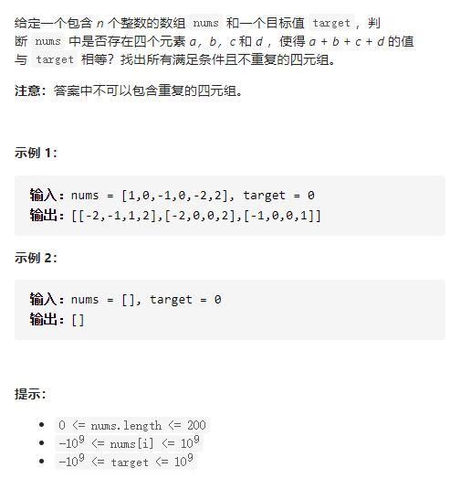

# 18-四数之和




## 方法1：排序+四指针（加上外面2层遍历的指针）

四数之和，和 **15.三数之和** 是一个思路，都是使用双指针法, 基本解法就是在 **15.三数之和** 的基础上再套一层for循环。

但是有一些细节需要注意，例如：不要判断`nums[k] > target` 就返回了，三数之和 可以通过 `nums[i] > 0` 就返回了，因为 0 已经是确定的数了，四数之和这道题目 target是任意值。

**15.三数之和** 的双指针解法是一层for循环num[i]为确定值，然后循环内有left和right下表作为双指针，找到nums[i] + nums[left] + nums[right] == 0。

四数之和的双指针解法是两层for循环nums[k] + nums[i]为确定值，依然是循环内有left和right下表作为双指针，找出nums[k] + nums[i] + nums[left] + nums[right] == target的情况， **三数之和** 的时间复杂度是 O( n^2 )，四数之和的时间复杂度是 O( n^3 ) 。

对于双指针法就是将原本暴力O( n^3 )的解法，降为O( n^2 )的解法，四数之和的双指针解法就是将原本暴力O( n^4 )的解法，降为O( n^3 )的解法。

```js
/**
 * @param {number[]} nums
 * @param {number} target
 * @return {number[][]}
 */
var fourSum = function (nums, target) {
    if (nums.length < 4) return []
    let res = []
    nums.sort((a, b) => a - b)
    for (let i = 0; i < nums.length - 3; i++) {
        if (i > 0 && nums[i] === nums[i - 1]) continue
        for (let j = i + 1; j < nums.length - 2; j++) {
            if (j > i + 1 && nums[j] === nums[j - 1]) continue
            let l = j + 1,
                r = nums.length - 1
            while (l < r) {
                let sum = nums[i] + nums[j] + nums[l] + nums[r]
                if (sum > target) {
                    r--
                } else if (sum < target) {
                    l++
                } else {
                    res.push([nums[i], nums[j], nums[l], nums[r]])
                    while (l < r && nums[l] === nums[l + 1]) l++
                    while (l < r && nums[r] === nums[r - 1]) r--
                    l++
                    r--
                }
            }
        }
    }
    return res
};
```

