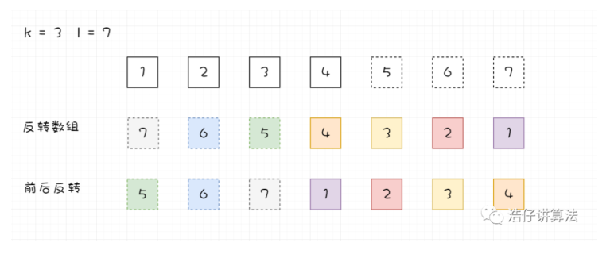

# 189-旋转数组

给定一个数组，将数组中的元素向右移动 ***k*** 个位置，其中 ***k*** 是非负数。


## 方法一：暴力法

### 时间复杂度：O(n*k)。每个元素都被移动 1 步（O(n)） k次（O(k)）

### 空间复杂度：O(1)。没有额外空间被使用。

```javascript
var rotate = function (nums, k) {
    let temp, pre;
    for (let i = 0; i < k; i++) {
        pre = nums[nums.length - 1];
        for (let j = 0; j < nums.length; j++) {
            temp = nums[j];
            nums[j] = pre;
            pre = temp;
        }
    }
};
```


## 方法二：使用额外数组

## 时间复杂度：O(n)。将数字放到新的数组中需要一遍遍历，另一边来把新数组的元素拷贝回原数组。

## 空间复杂度：O(n)。另一个数组需要原数组长度的空间。

```javascript
var rotate = function (nums, k) {
    let res = [];
    for (let i = 0; i < nums.length; i++) {
        res[(i + k) % nums.length] = nums[i];
    }
    for (let i = 0; i < nums.length; i++) {
        nums[i] = res[i];
    }
};
```


## (最简！）方法三：将最后一个pop后放到第一个

### 时间复杂度：O(n*k)。因为unshift是O(n)的操作。

### 空间复杂度：O(1)。没有额外空间被使用。

```javascript
var rotate = function (nums, k) {
    for (let i = 0; i < k; i++) {
        nums.unshift(nums.pop());
    }
};
```


## (推荐！）方法四：原地反转-双指针夹逼反转数组

### 这个方法基于这个事实：当我们旋转数组 **k** 次， ***k % n*** 个尾部元素会被移动到头部，剩下的元素会被向后移动。 在这个方法中，我们首先将所有元素反转。然后反转前 **k** 个元素，再反转后面 **n - k** 个元素，就能得到想要的结果。



### 时间复杂度：O(n) 。n 个元素被反转了总共 3 次。

### 空间复杂度：O(1) 。没有使用额外的空间。

```javascript
var rotate = function (nums, k) {
    if (nums == null || nums.length <= 1) return;
    k %= nums.length;  // k % n 个尾部元素会被移动到头部
    reverse(nums, 0, nums.length - 1);
    reverse(nums, 0, k - 1);
    reverse(nums, k, nums.length - 1);
    // 定义数组反转函数
    function reverse(nums, start, end) {
        while (start < end) {
            let temp = nums[start];
            nums[start] = nums[end];
            nums[end] = temp;
            start++;
            end--;
        }
    }
};
```

