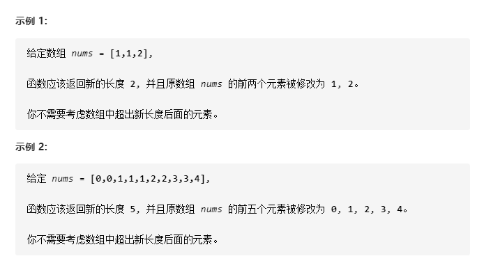

# 26-删除排序数组中的重复项

给定一个排序数组，你需要在 **原地** 删除重复出现的元素，使得每个元素只出现一次，返回移除后数组的新长度。

不要使用额外的数组空间，你必须在 **原地** **修改输入数组** 并在**使用 O(1) 额外空间的条件下完成**！



**提示：**

- `0 <= nums.length <= 3 * 104`
- `-104 <= nums[i] <= 104`
- `nums` 已按升序排列


## 方法一：暴力法

### 时间复杂度：因为删除重复元素是群移O(n)的操作，因此最坏O(n^2)

### 空间复杂度：O(1)

```javascript
var removeDuplicates = function (nums) {
    if (nums == null || nums.length < 2) return nums.length;
    for (let i = 0; i < nums.length; i++) {
        // 有重复元素直接删除
        if (nums[i] === nums[i + 1]) {
            nums.splice(i, 1);
            i--;
        }
    }
    return nums.length;
};
```


## 方法二：快慢双指针


### 时间复杂度：O(n)

### 空间复杂度：O(1)

```javascript
var removeDuplicates = function (nums) {
    if (nums == null || nums.length < 2) return nums.length;
    let i = 0;
    for (let j = 1; j < nums.length; j++) {
        if (nums[j] != nums[i]) {
            i++;
            nums[i] = nums[j];
        }
    }
    return i + 1;
};

// 优化版1
var removeDuplicates = function (nums) {
    if (nums == null || nums.length < 2) return nums.length;
    let i = 0;
    for (let j = 1; j < nums.length; j++) {
        if (nums[j] != nums[i]) {
            i++;
            //避免重复赋值相同的值
            if (nums[j] != nums[i]) {
                nums[i] = nums[j];
            }
        }
    }
    return i + 1;
};

// （推荐！！！）优化版2
var removeDuplicates = function (nums) {
    if (nums == null || nums.length < 2) return nums.length;
    let i = 0;
    for (let j = 1; j < nums.length; j++) {
        if (nums[j] != nums[i]) {
            //避免重复赋值相同的值
            if (nums[j] != nums[i + 1]) {
                nums[i + 1] = nums[j];
            }
            i++;
        }
    }
    return i + 1;
};

// 优化版3
var removeDuplicates = function (nums) {
    if (nums == null || nums.length < 2) return nums.length;
    let i = 0;
    for (let j = 1; j < nums.length; j++) {
        if (nums[j] != nums[i]) {
            //避免重复赋值相同的值
            if (j > i + 1) {
                nums[i + 1] = nums[j];
            }
            i++;
        }
    }
    return i + 1;
};
```

