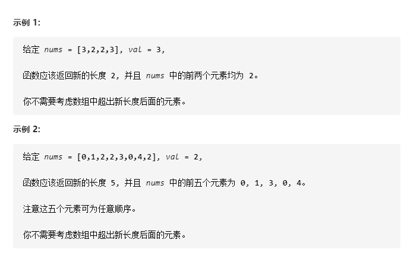

# 27-移除元素

给你一个数组 **nums** 和一个值 **val**，你需要 **原地** 移除所有数值**等于** **val** 的元素，并返回移除后数组的新长度。

不要使用额外的数组空间，你**必须仅使用 O(1) 额外空间**并 **原地** 修改输入数组！

元素的顺序可以改变。你不需要考虑数组中超出新长度后面的元素！




## 方法一：暴力法

### 时间复杂度：因为删除重复元素是群移O(n)的操作，因此最坏O(n^2)

### 空间复杂度：O(1)

```javascript
var removeElement = function (nums, val) {
    for (let i = 0; i < nums.length; i++) {
        if (nums[i] == val) {
            nums.splice(i, 1);
            i--;
        }
    }
    return nums.length;
};
```


## （推荐！）方法二：快慢双指针（与 283-移动零 的双指针类似 更适用移除元素较多）

### 时间复杂度：O(n)

### 空间复杂度：O(1)

```javascript
var removeElement = function (nums, val) {
     let len = nums.length
    let j = 0
    for (let i = 0; i < len; i++) {
        if (nums[i] !== val) {
            // 避免自己赋值给自己，以及重复赋值相同的值
            if (i != j || nums[j] === nums[i]) {
                nums[j] = nums[i]
            }
            j++
        }
    }
    return j
};
```


## 方法三：双指针夹逼 （更适用移除元素较少）

### 时间复杂度：O(n)

### 空间复杂度：O(1)

```javascript
var removeElement = function (nums, val) {
    let i = 0;
    let j = nums.length;  // 记录元素的个数
    while (i < j) {
        if (nums[i] == val) {
            nums[i] = nums[j - 1];
            j--;
        } else {
            i++;
        }
    }
    return j;
};
```

