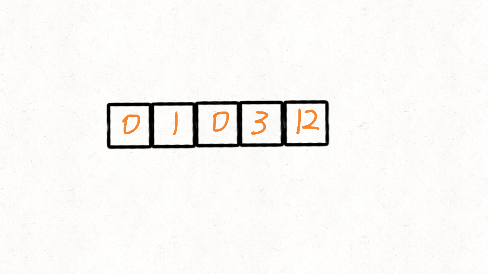

# 283-移动零   一维数组的坐标变换！

给定一个数组 `nums`，编写一个函数将所有 `0` 移动到数组的末尾，同时保持非零元素的相对顺序。

**示例:**

```
输入: [0,1,0,3,12]
输出: [1,3,12,0,0]
```

**说明**:

1. 必须在原数组上操作，不能拷贝额外的数组。
2. 尽量减少操作次数。


## 方法一：直接覆盖写法-两次遍历：遍历数组，将非0元素放到前面；再遍历数组，最后将剩下的元素置0



```javascript
var moveZeroes = function(nums) {
    var j = 0;  // j表示新添加的非0元素的位置
    for (var n = 0; n < nums.length; n++) {
        if (nums[n] != 0) {
            nums[j] = nums[n];
            j++;
        }
    }
    for (var i = j; i < nums.length; i++) {
        nums[i] = 0;
    }
};
```

### 时间复杂度： O(n)

### 空间复杂度： O(1)


## 方法二：直接覆盖写法-一次遍历：遍历数组，直接操作index将非0元素放到前面，同时将原来位置的元素置0

```javascript
var moveZeroes = function(nums) {
    var j = 0;  // j表示新添加的非0元素的位置
    for (var i = 0; i < nums.length; i++) {
        if (nums[i] != 0) {
            nums[j] = nums[i];   
            if (i != j) {
                nums[i] = 0;
            }
            j++;
        }
    }
};
```

### 时间复杂度： O(n)

### 空间复杂度： O(1)


## （推荐！）优化写法：它避免了数组开头是非零元素的交换也就是阻止（i==j）时交换。

```javascript
var moveZeroes = function (nums) {
    if (nums == null || nums.length == 0) {
        return;
    }
    var j = 0;  // j表示新添加的非0元素的位置
    for (var i = 0; i < nums.length; i++) {
        if (nums[i] != 0) {
            if (i != j) {
                nums[j] = nums[i];
                nums[i] = 0;
            }
            j++;
        }
    }
};
```


## （最优解）方法三：双指针交换非0

1. 定义两个变量，其中一个变量遍历整个数组。
2. 遇到非0元素，将其交换到左边。
3. 遇到等于0的元素，交换到右边。


```javascript
var moveZeroes = function (nums) {
    if (nums == null || nums.length == 0) {
        return;
    }
    var j = 0;  // 左边第一个0所在的位置
    for (var i = 0; i < nums.length; i++) {
        if (nums[i] != 0) {
            if (i != j) {
                var temp = nums[i];
                nums[i] = nums[j];
                nums[j] = temp;
            }
            j++;
        }
    }
};
```

### 时间复杂度： O(n)

### 空间复杂度： O(1)

### 注：前三个方法为双指针操作数组！


##  (最简单，但因时间复杂度高，所以不推荐)

## 方法四：从数组末尾开始删除0的元素，同时添加0到数组末尾

```javascript
var moveZeroes = function (nums) {
    for (var i = nums.length - 1; i >= 0; i--) {
        if (nums[i] === 0) {
            nums.splice(i, 1);
            nums.push(0);
        }
    }
};
```

### 时间复杂度： 因为删除0是群移O(n)的操作，因此最坏O(n^2)

### 空间复杂度： O(1)

### 注：此方法为单指针循环操作数组！


