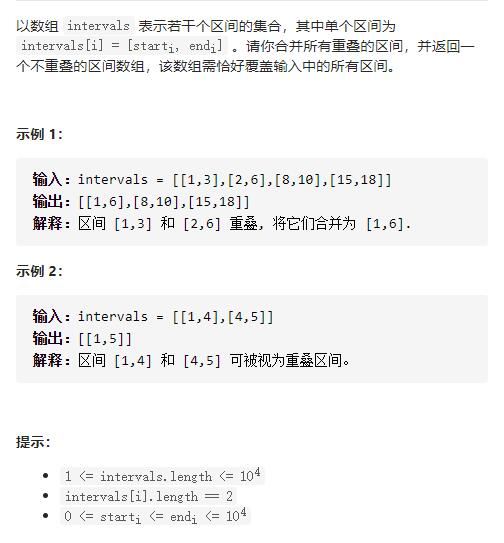

# 56-合并区间




## 方法1：排序+双指针

时间复杂度：即排序的时间复杂度O(n logn)

空间复杂度：即排序所需要的空间复杂度O(logn)

首先，我们将列表中的区间按照左端点升序排序。然后我们将第一个区间加入 merged 数组中，并按顺序依次考虑之后的每个区间：

如果当前区间的左端点在数组 merged 中最后一个区间的右端点之后，那么它们不会重合，我们可以直接将这个区间加入数组 merged 的末尾；

否则，它们重合，我们需要用当前区间的右端点更新数组 merged 中最后一个区间的右端点，将其置为二者的较大值。

区间问题的解决思路一般就是先排序再处理：
1、根据区间的左边界做升序处理；
2、取排序后的第一个区间放入到结果数组；
3、迭代处理剩余的区间，由于所有的区间已经根据左边界进行排序处理了，故剩余区间的左边界都是小于等于结果数组中区间的左边界；
4、此时只需要判断未处理区间interval的左边界与结果数组中最后一个区间resInterval的右边界，分为三种情况：
4.1、interval的左边界小于等于resInterval的右边界，interval的右边界大于resInterval的右边界，则interval和resInterval相交，此时需要更新resInterval的右边界；
4.2、interval的左边界小于等于resInterval的右边界，interval的右边界小于resInterval的右边界，则resInterval包含interval，不需要处理；
4.3、interval的左边界大于resInterval的右边界，则interval和resInterval不相交；
5、结合4的三种情况，合并一下，如果相交或包含，则更新resInterval的右边界；如果不相交，则将新区间放入结果数组中。

```js
var merge = function (intervals) {
    intervals.sort((a, b) => a[0] - b[0]) //按区间左下界排序
    let res = [intervals[0]] //结果数组
    //从第二个开始遍历
    for (let i = 1; i < intervals.length; i++) {
        //若结果数组中上一个区间的上界小于当前区间的下界则将当前区间加入到结果数组中，即无重叠
        //若有重叠，则将上一个区间的上界改变
        if (intervals[i][0] > res[res.length - 1][1]) {
            res.push(intervals[i])
        } else {
            res[res.length - 1][1] = Math.max(res[res.length - 1][1], intervals[i][1])
        }
    }
    return res
};
```

