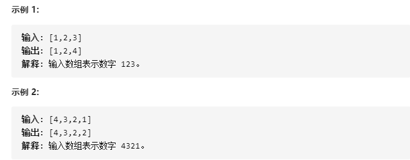

# 66-加一

给定一个由**整数**组成的**非空数组**所表示的非负整数，在该数的基础上加一。

最高位数字存放在数组的首位， 数组中每个元素只存储**单个数字**。

你可以假设除了整数 0 之外，这个整数不会以零开头。




## 方法一：末尾判断法 (非9与9)

### 时间复杂度： O(n)

### 空间复杂度： O(1)

```javascript
// while解法
var plusOne = function (digits) {
    let i = digits.length - 1
    // 从末尾开始判断
    while (i >= 0) {
        // 分 不进位( < 9) 和 进位( > 9) 2种情况
        if (digits[i] + 1 < 10) {
            digits[i]++;
            return digits;
        } else {
            digits[i] = 0;
        }
        i--;
    }
    // 循环结束未返回说明是 全 9 的情况 如: 99, 999
    // 于是添加1到最前面
    digits.splice(0, 0, 1);
    return digits;
};


// for解法
var plusOne = function (digits) {
    // 从末尾开始判断
    for (let i = digits.length - 1; i >= 0; i--) {
        // 分 不进位( < 9) 和 进位( > 9) 2种情况
        if (digits[i] + 1 < 10) {
            digits[i]++;
            return digits;
        } else {
            digits[i] = 0;
        }
    }
    // 循环结束未返回说明是 全 9 的情况 如: 99, 999
    // 于是添加1到最前面
    digits.unshift(1);
    //或
    //rerurn [1, ...digits]
    return digits;
};


//写法3
var plusOne = function (digits) {
    for (let i = digits.length - 1; i >= 0; i--) {
        if (digits[i] !== 9) {  // 相当于 digits[i] + 1 < 10
            digits[i]++;
            break;
        } else {
            digits[i] = 0
            if (i === 0) {  // 即到最高位了
                digits.unshift(1);
            }
        }
    }
    return digits;
}
```

