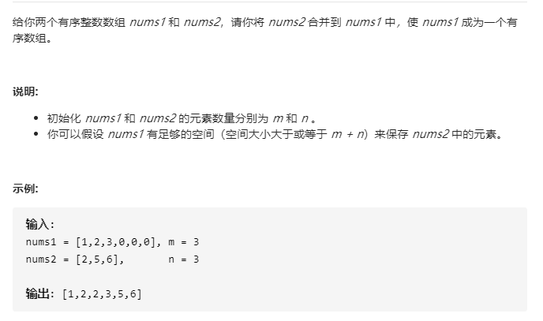
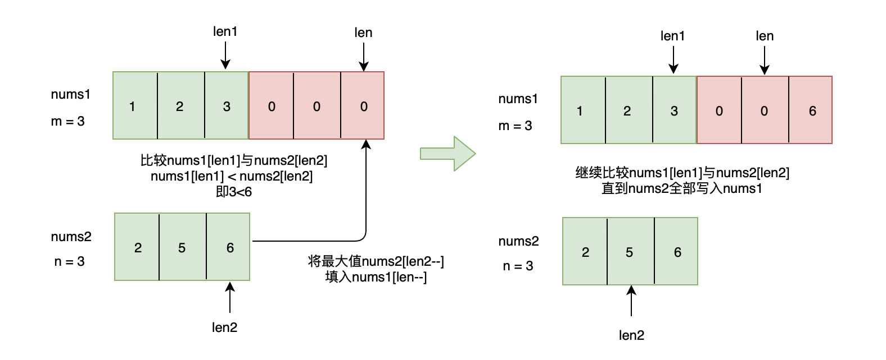

# 88-合并两个有序数组




## 方法一：合并后排序

### 时间复杂度：O( (n+m)log(n+m) )

### 空间复杂度：O(1)

```javascript
var merge = function (nums1, m, nums2, n) {
    for (var i = 0; i < n; i++) {
        nums1[m + i] = nums2[i];
    }
    nums1.sort(function (a, b) {
        return a - b;  // 升序
    })
};
```


## (推荐！）方法二：三指针 / 从后往前

### 时间复杂度 : O(n+m)

### 空间复杂度 : O(1)



```javascript
var merge = function (nums1, m, nums2, n) {
    let p1 = m - 1;
    let p2 = n - 1;
    let p = m + n - 1;
    while (p2 >= 0) {
        // num1排完，num2没合并完的情况
        //if (p1 < 0) {
        //    nums1[p--] = nums2[p2--];
        //    continue;
        //}
        // 其实这里包括了上面的特殊情况，上面的if也可不写
        nums1[p--] = nums1[p1] >= nums2[p2] ? nums1[p1--] : nums2[p2--];
    }
};

var merge = (nums1, m, nums2, n) => {
    let index1 = m - 1;
    let index2 = n - 1;
    let tail = m + n - 1;
    while (index2 >= 0) {
        // 包含num1排完，num2没合并完的情况
        if (nums1[index1] >= nums2[index2]) {
            nums1[tail] = nums1[index1];
            index1--;
            tail--;
        } else {
            nums1[tail] = nums2[index2];
            index2--;
            tail--;
        }
    }
}
```

