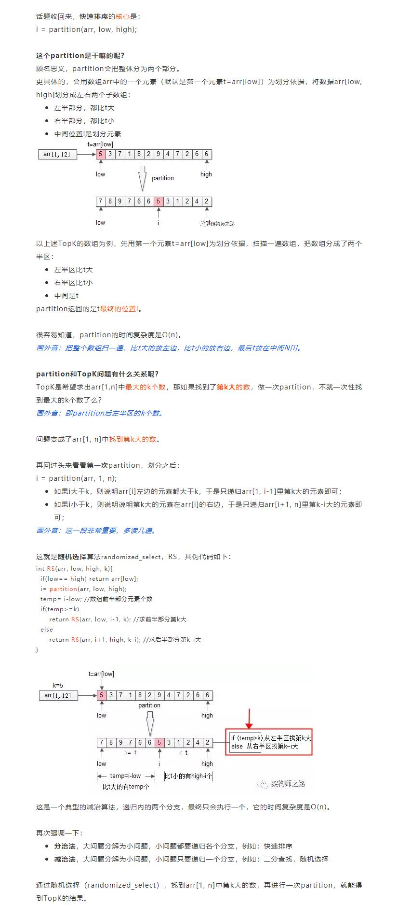

# 215-数组中的第K个最大元素

### 给定整数数组 `nums` 和整数 `k`，请返回数组中第 `k` 个最大的元素。

### 请注意，你需要找的是数组排序后的第 `k` 个最大的元素，而不是第 `k` 个不同的元素。

**示例 1:**

```
输入: [3,2,1,5,6,4] 和 k = 2
输出: 5
```

**示例 2:**

```
输入: [3,2,3,1,2,4,5,5,6] 和 k = 4
输出: 4
```

**提示：**

- `1 <= k <= nums.length <= 10^4`
- `-10^4 <= nums[i] <= 10^4`


## 方法1：暴力法-排序（全部元素）+选择第k个

**时间复杂度：O（n log n）**

```js
/**
 * @param {number[]} nums
 * @param {number} k
 * @return {number}
 */
var findKthLargest = function (nums, k) {
    //从小到大
    let n = nums.length
    nums.sort((a, b) => a - b)
    return nums[n - k]
    //从大到小
    // nums.sort((a, b) => b - a)
    // return nums[k - 1]
};
```


## 方法2：局部排序-冒泡排序k次（只排序TopK个数）

**时间复杂度：O(n*k)**

```js
//局部排序-冒泡排序k次（只排序TopK个数）
var findKthLargest = function (nums, k) {
    let n = nums.length
    for (let i = 0; i < k; i++) {
        for (let j = 0; j < n - i - 1; j++) {
            if (nums[j] > nums[j + 1]) {
                let temp = nums[j + 1]
                nums[j + 1] = nums[j]
                nums[j] = temp
            }
        }
    }
    return nums[n - k]
};
```


## （推荐！）方法3：减治思想-基于快速排序改进

### 本质：随机选择算法+partition

**时间复杂度：随机选择 O(n)**

**分治法**（Divide&Conquer），把一个大的问题，转化为若干个子问题（Divide），每个子问题“**都**”解决，大的问题便随之解决（Conquer）。这里的关键词是**“都”**。从伪代码里可以看到，快速排序递归时，先通过partition把数组分隔为两个部分，两个部分“都”要再次递归。

分治法有一个特例，叫减治法。

**减治法**（Reduce&Conquer），把一个大的问题，转化为若干个子问题（Reduce），这些子问题中“**只**”解决一个，大的问题便随之解决（Conquer）。这里的关键词是**“只”**。

通过分治法与减治法的描述，可以发现，分治法的复杂度一般来说是大于减治法的。

- **分治法**，大问题分解为小问题，小问题都要递归各个分支，例如：快速排序 O (n log n)
- **减治法**，大问题分解为小问题，小问题只要递归一个分支，例如：二分查找O (log n)，随机选择O(n)



```js
var findKthLargest = function (nums, k) {
    let n = nums.length,
        target = n - k,
        l = 0,
        r = n - 1

    while (true) {
        let mid = partition(nums, l, r)
        if (target === mid) {
            return nums[n - k]
        } else if (target > mid) {
            l = mid + 1
        } else {
            r = mid - 1
        }
    }

    function partition(arr, l, r) {
        //随机选择基准，解决数组基本有序的问题
        if (l < r) {
            let ranIndex = l + Math.floor(Math.random() * (r - l))
            let temp = arr[l]
            arr[l] = arr[ranIndex]
            arr[ranIndex] = temp
        }
        let pivot = arr[l]
        while (l < r) {
            while (l < r && arr[r] >= pivot) r--
            if (l < r) {
                arr[l] = arr[r]
                l++
            }
            while (l < r && arr[l] < pivot) l++
            if (l < r) {
                arr[r] = arr[l]
                r--
            }
        }
        arr[l] = pivot
        return l
    }
};
```


## 方法4：堆排序

**时间复杂度：O（n log n）**

我们也可以使用堆排序来解决这个问题—建立一个大顶堆，做 k - 1 次删除操作后堆顶元素就是我们要找的答案。

```js
//4.基于堆排序
var findKthLargest = function (nums, k) {
    let n = nums.length
    buildMaxHeap(nums)
    //此处写nums.length，因为n是控制堆元素个数，会改变
    for (let i = nums.length - 1; i >= nums.length - k + 1; i--) {
        swap(nums, 0, i)
        n--
        heapify(nums, 0)
    }
    return nums[0]
    function buildMaxHeap(arr) {
        for (let i = Math.floor(n / 2) - 1; i >= 0; i--) {
            heapify(arr, i)
        }
    }
    function heapify(arr, i) {
        let l = 2 * i + 1,
            r = 2 * i + 2,
            largest = i
        if (l < n && arr[l] > arr[largest]) {
            largest = l
        }
        if (r < n && arr[r] > arr[largest]) {
            largest = r
        }
        if (largest !== i) {
            swap(arr, i, largest)
            heapify(arr, largest)
        }
    }

    function swap(arr, i, j) {
        let temp = arr[j];
        arr[j] = arr[i];
        arr[i] = temp;
    }
};
```

