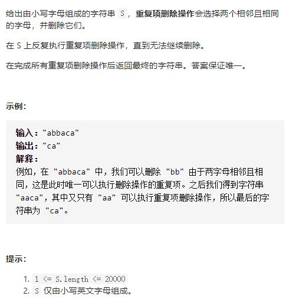

# 1047-删除字符串中的所有相邻重复项




## 方法1：栈

```js
var removeDuplicates = function(s) {
    let stack = []
    for(let c of s){
        let pre = stack.pop()
        if(c !== pre) { //将出栈的元素（上一个元素）与当前遍历的元素对比
            stack.push(pre)
            stack.push(c)
        }
    }
    return stack.join("")
};
```

