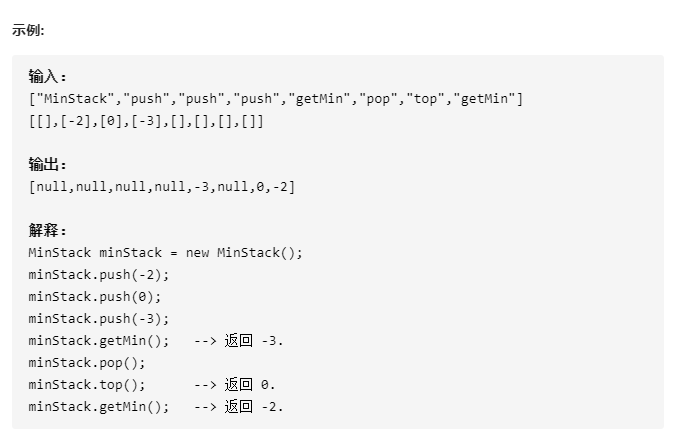
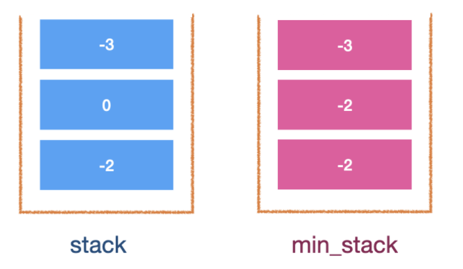
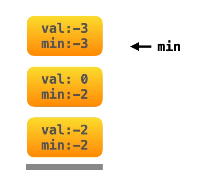

# 155-最小栈

设计一个支持 push ，pop ，top 操作，并能在常数时间内检索到最小元素的栈。

- push(x) —— 将元素 x 推入栈中。
- pop() —— 删除栈顶的元素。
- top() —— 获取栈顶元素。
- getMin() —— 检索栈中的最小元素。



**提示：**

- `pop`、`top` 和 `getMin` 操作总是在 **非空栈** 上调用。


## 方法一：使用双栈 - 数据栈 + 辅助栈



### 时间复杂度：各操作都是O(1)

### 空间复杂度：O(n)

```javascript
var MinStack = function () {
    this.stack = [];
    this.minStack = [];
};

MinStack.prototype.push = function (x) {
    this.stack.push(x);
    if (this.minStack.length === 0) this.minStack.push(x);
    else {
        this.minStack.push(Math.min(x, this.minStack[this.minStack.length - 1]));
    }
};

//2.将最小元素的栈数组设为无限容量MinStack，第一次push可不用检查数组为0的情况
//var MinStack = function () {
//    this.stack = [];
//    this.minStack = [Infinity];
//};

//MinStack.prototype.push = function (x) {
//    this.stack.push(x);
//    this.minStack.push(Math.min(x, this.minStack[this.minStack.length - 1]));
//};

MinStack.prototype.pop = function () {
    this.stack.pop();
    this.minStack.pop();
};

MinStack.prototype.top = function () {
    return this.stack[this.stack.length - 1];
};

MinStack.prototype.getMin = function () {
    return this.minStack[this.minStack.length - 1];
};
```


## (推荐！) 方法二：单栈 - 使用对象入栈，保存数据和当前的最小值（用数组也可以保存2个值）



### 时间复杂度：各操作都是O(1)

### 空间复杂度：O(n)

```javascript
var MinStack = function () {
    this.stack = [];
};

MinStack.prototype.push = function (x) {
    this.stack.push({
        value: x,
        min: this.stack.length == 0 ? x : Math.min(x, this.getMin())
    });
};

MinStack.prototype.pop = function () {
    this.stack.pop();
};

MinStack.prototype.top = function () {
    return this.stack[this.stack.length - 1].value;
};

MinStack.prototype.getMin = function () {
    return this.stack[this.stack.length - 1].min;
};
```

