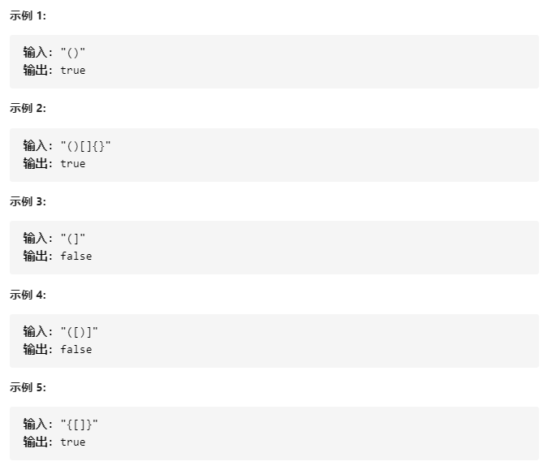
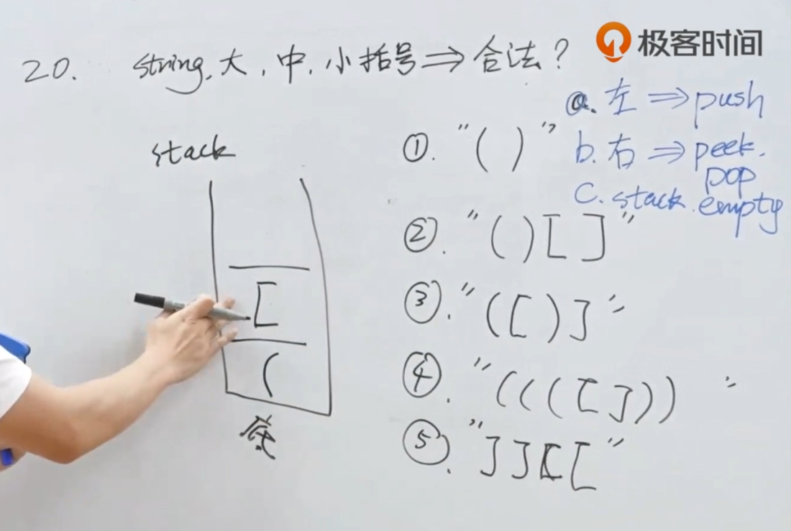
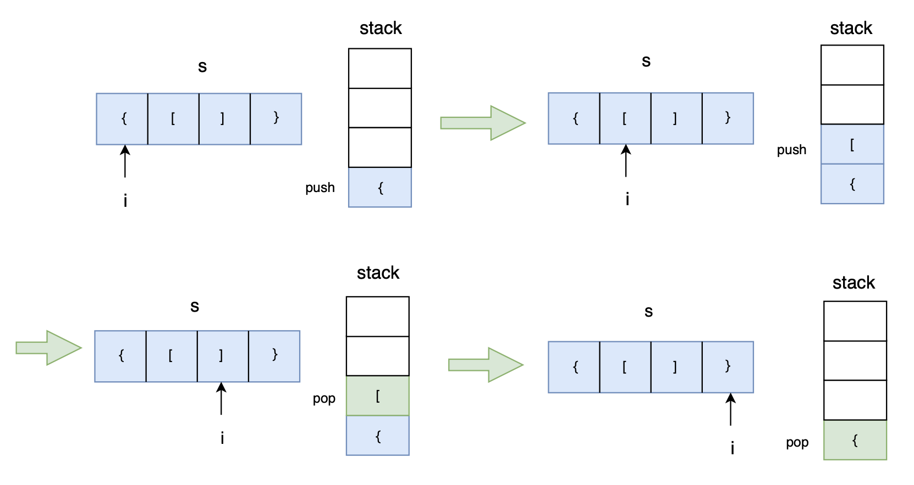

# 20-有效的括号

给定一个只包括 '('，')'，'{'，'}'，'['，']' 的字符串，判断字符串是否有效。

有效字符串需满足：

左括号必须用相同类型的右括号闭合。

左括号必须以正确的顺序闭合。

之前的题目：**注意：**空字符串可被认为是有效字符串！



现在的题目，去掉了字符串为空的情况！！！

**提示：**

- `1 <= s.length <= 104`
- `s` 仅由括号 `'()[]{}'` 组成


## 方法一：栈+哈希map（推荐！）





### 时间复杂度：O(n)

### 空间复杂度：O(n)

```javascript
// 方案一：[[')', '('], [']', '['], ['}', '{']]
var isValid = function (s) {
    if (s.length === 0) return true;
    if (s.length % 2 === 1) return false;
    let stack = [];
    
    //2. 
    let p_map = new Map([[')', '('], [']', '['], ['}', '{']]);
    // 1.
    // p_map.set(')', '(');
    // p_map.set(']', '[');
    // p_map.set('}', '{');
    
    for (let c in s) {
        if (!p_map.has(s[c])) {
            stack.push(s[c]);
        // 1. } else if (stack.length === 0 || p_map.get(s[c]) !== stack.pop()) {
        // 2. 
        } else if (!stack.length || p_map.get(s[c]) !== stack.pop()) {
            return false;
        }
    }
    
    // 1. return stack.length === 0;
    //2. 
    return !stack.length;
};


// 方案二：[['(', ')'], ['[', ']'], ['{', '}']]
var isValid = function (s) {
    if (s.length === 0) return true;
    if (s.length % 2 === 1) return false;
    let stack = [];
    let p_map = new Map([['(', ')'], ['[', ']'], ['{', '}']]);
    for (let c in s) {
        if (p_map.has(s[c])) {
            stack.push(s[c]);
        } else if (!stack.length || s[c] !== p_map.get(stack.pop())) {
            return false;
        }
    }
    return !stack.length;
};


// (推荐！) 方案三：用对象模拟map
var isValid = function (s) {
    if (s.length === 0) return true;
    if (s.length % 2) return false;
    let map = {
        "(": ")",
        "[": "]",
        "{": "}"
    };
    let stack = [];
    for (let c of s) {
        if (map[c]) {
        // if (c in map) {
            stack.push(c);
        } else if (c !== map[stack.pop()]) {
            return false;
        }
    }
    return !stack.length;
};


// 方法四：用switch逐个匹配处理
var isValid = function (s) {
    if (s.length === 0) return true;
    if (s.length % 2) return false;
    let arr = [];
    for (let c of s){
        switch (c) {
            case "(": {
                arr.push(c);
                break;
            }
            case "[": {
                arr.push(c);
                break;
            }
            case "{": {
                arr.push(c);
                break;
            }
            case ")": {
                if (arr.pop() !== "(") return false;
                break;
            }
            case "]": {
                if (arr.pop() !== "[") return false;
                break;
            }
            case "}": {
                if (arr.pop() !== "{") return false;
                break;
            }
        }
    }
    return !arr.length;
};
```


## 方案二：暴力法 - 查找一对的括号并删除，如 ( )  [ ]  { }

### 时间复杂度：O(n^2)

```javascript
var isValid = function (s) {
    while (s.length) {
        let temp = s;
        s = s.replace('()', '');
        s = s.replace('[]', '');
        s = s.replace('{}', '');
        if (s == temp) return false;
    }
    return true;
};
```


