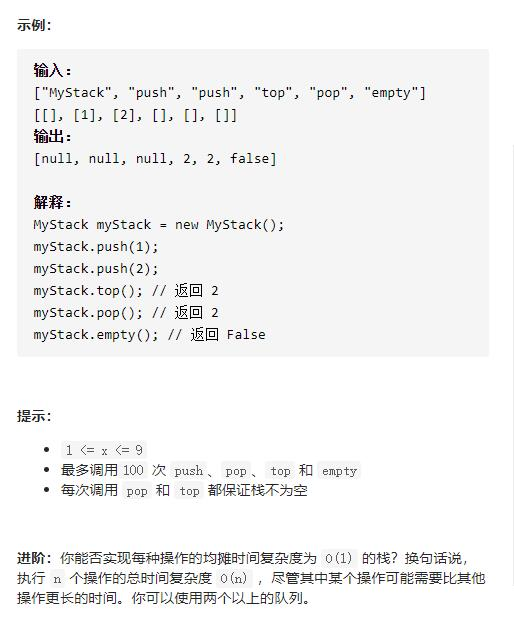
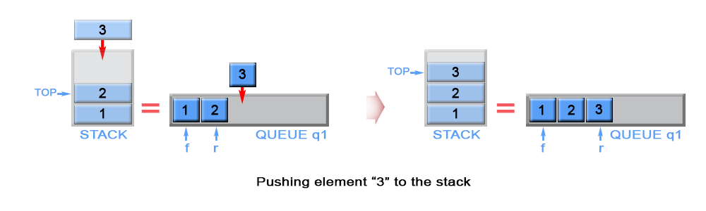
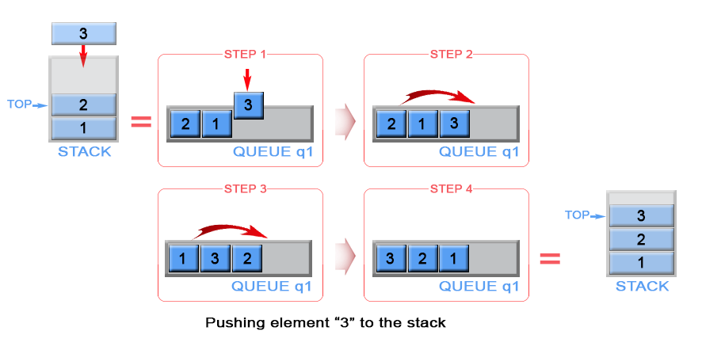

# 225-用队列实现栈

请你仅使用两个队列实现一个后入先出（LIFO）的栈，并支持普通栈的全部四种操作（push、top、pop 和 empty）。

实现 MyStack 类：

- void push(int x) 将元素 x 压入栈顶。

- int pop() 移除并返回栈顶元素。

- int top() 返回栈顶元素。

- boolean empty() 如果栈是空的，返回 true ；否则，返回 false

**注意:**

- 你只能使用队列的基本操作-- 也就是 push to back, peek/pop from front, size, 和 is empty 这些操作是合法的。
- 你所使用的语言也许不支持队列。 你可以使用 list 或者 deque（双端队列）来模拟一个队列 , 只要是标准的队列操作即可。
- 你可以假设所有操作都是有效的（例如, 对一个空的栈不会调用 pop 或者 top 操作）。




## 方法一：两个队列，压入 - O(1)，弹出 - O(n)

### 时间复杂度：弹出O(n)，其他O(1)

### 空间复杂度：各操作O(1)，总体O(n)

1. 使用两个队列，q1用来存储栈，q2保持为空。
2. 每次入栈都将元素存入q1，此时栈顶元素在q1队尾，利用length获取末尾元素
3. 出栈时将q1的非队尾元素存入队列q2，q1中剩下的元素即为栈顶，将其出队即为出栈操作。再将q1与q2互换即可




如下面动画所示，**用两个队列que1和que2实现队列的功能，que2其实完全就是一个备份的作用**，把que1最后面的元素以外的元素都备份到que2，然后弹出最后面的元素，再把其他元素从que2导回que1。


```javascript
var MyStack = function () {
    this.q1 = [];
    this.q2 = [];
};

MyStack.prototype.push = function (x) {
    this.q1.push(x);
};

MyStack.prototype.pop = function () {
    while (this.q1.length > 1) {
        this.q2.push(this.q1.shift());
    }
    let re = this.q1.shift();
    // 1.此处将q2赋给q1，同时把q2置空
    this.q1 = this.q2;
    this.q2 = [];
    // 2.q1和q2互换
    // let temp = this.q1;
    // this.q1 = this.q2;
    // this.q2 = temp;
    return re;
};

MyStack.prototype.top = function () {
    return this.q1[this.q1.length - 1];
};

MyStack.prototype.empty = function () {
    return !this.q1.length;
};
```


## (推荐！) 方法二：一个队列， 压入 - O(n)， 弹出 - O(1)

### 时间复杂度：入队，平均O(1)，最坏O(n)，其他O(1)

### 空间复杂度：O(n)

入栈时将元素加入队列的队尾，之后将其之前元素依次出队，同时存入队尾。这样队列就被翻转了一次，出队操作就变成了出栈操作。



```javascript
var MyStack = function () {
    this.q1 = [];
};

MyStack.prototype.push = function (x) {
    this.q1.push(x);
    //此处建议不要用while，否则死循环
    for (let i = 0; i < this.q1.length - 1; i++) {
        this.q1.push(this.q1.shift());
    }
};

MyStack.prototype.pop = function () {
    return this.q1.shift();
};

MyStack.prototype.top = function () {
    return this.q1[0];
};

MyStack.prototype.empty = function () {
    return !this.q1.length;
};
```

