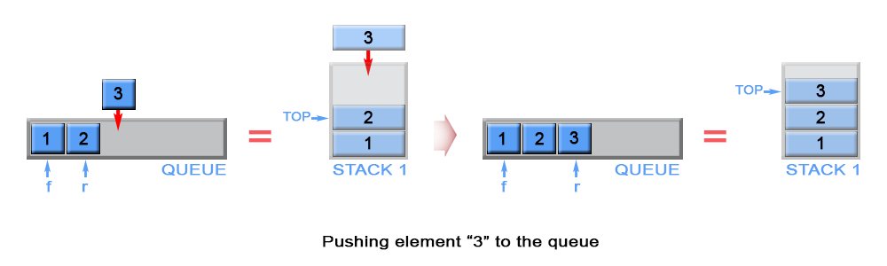

# 232-用栈实现队列

请你仅使用两个栈实现先入先出队列。队列应当支持一般队列支持的所有操作（`push`、`pop`、`peek`、`empty`）：

实现 MyQueue 类：

- void push(int x) ：将元素 x 推到队列的末尾

- int pop() ：从队列的开头移除并返回元素

- int peek() ：返回队列开头的元素

- boolean empty() ：如果队列为空，返回 true ；否则，返回 false


## 方法一：使用两个栈 入队 - O(n)， 出队 - O(1)

### 时间复杂度：入队O(n)，其他O(1)

### 空间复杂度：O(n)

1. 入队时，将s1的元素倒过来存入s2。
2. 再将入队元素存入s1，这样s2中的元素顺序就与入队顺序相同。
3. 最后将s2元素再倒过来存入s1，这样s1中元素的顺序与入队顺序相反，此时进行出栈操作的元素就与出队操作相同。


```javascript
var MyQueue = function () {
    this.s1 = [];
    this.s2 = [];
};

MyQueue.prototype.push = function (x) {
    while(this.s1.length){
        this.s2.push(this.s1.pop());
    }
    // 直接入栈s1比入栈s2少2步操作
    this.s1.push(x);
    // this.s2.push(x);
    while(this.s2.length){
        this.s1.push(this.s2.pop());
    }
};

MyQueue.prototype.pop = function () {
    return this.s1.pop();
};

MyQueue.prototype.peek = function () {
    return this.s1[this.s1.length - 1];
};

MyQueue.prototype.empty = function () {
    return !this.s1.length;
};
```


## (推荐！) 方法二：使用两个栈 入队 - O(1)，出队 - 平均复杂度 O(1)

### 时间复杂度：出队，平均O(1)，最坏O(n)，其他O(1)

### 空间复杂度：O(n)

1. 使用两个栈，s1中存储的是后入队的元素，s2中存储的是先入队的元素
2. 入队时，元素默认存储在s1。
3. 出队时，默认从s2进行出栈操作，如果s2为空，则将s1中元素转移到s2。
4. 如果s2有值，则队首在s2的栈顶。否则，队首在s1栈底。
5. 由于s1的元素只有在pop时才会转移到s2，因此只有两个栈都为空时，队列才为空。




```javascript
var MyQueue = function () {
    this.s1 = [];
    this.s2 = [];
};

MyQueue.prototype.push = function (x) {
    this.s1.push(x);
};

MyQueue.prototype.pop = function () {
    if (!this.s2.length) {
        while (this.s1.length) {
            this.s2.push(this.s1.pop());
        }
    }
    return this.s2.pop();
};

MyQueue.prototype.peek = function () {
    return this.s2.length ? this.s2[this.s2.length - 1] : this.s1[0]
    //return !this.s2.length ? this.s1[0] : this.s2[this.s2.length - 1];
};

MyQueue.prototype.empty = function () {
    return !this.s1.length && !this.s2.length
    //return !(this.s1.length || this.s2.length);
};
```

