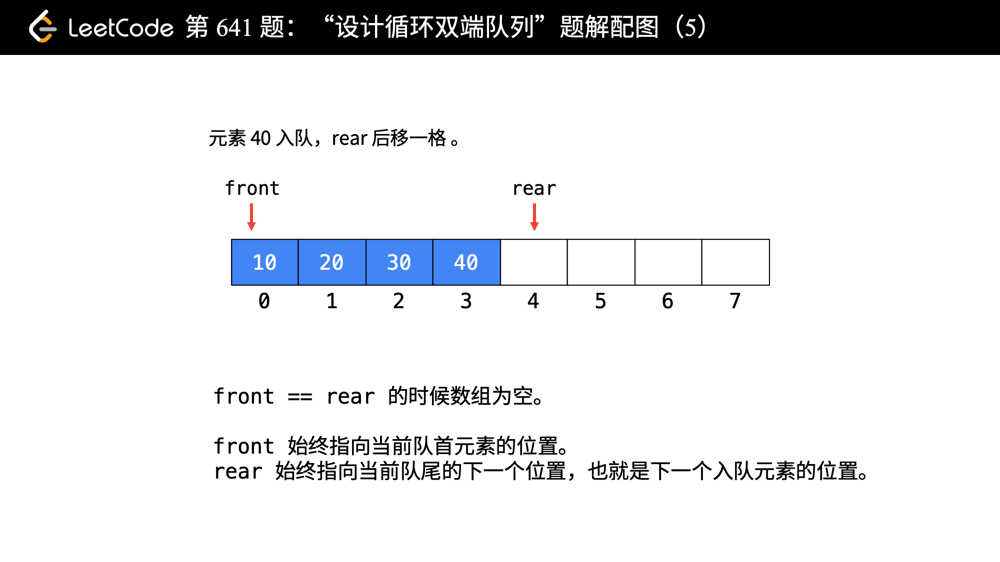

# 641-设计循环双端队列

### 设计实现双端队列。

### 你的实现需要支持以下操作：

- MyCircularDeque(k)：构造函数,双端队列的大小为k。
- insertFront()：将一个元素添加到双端队列头部。 如果操作成功返回 true。
- insertLast()：将一个元素添加到双端队列尾部。如果操作成功返回 true。
- deleteFront()：从双端队列头部删除一个元素。 如果操作成功返回 true。
- deleteLast()：从双端队列尾部删除一个元素。如果操作成功返回 true。
- getFront()：从双端队列头部获得一个元素。如果双端队列为空，返回 -1。
- getRear()：获得双端队列的最后一个元素。 如果双端队列为空，返回 -1。
- isEmpty()：检查双端队列是否为空。
- isFull()：检查双端队列是否满了。


## 方法一：

### 1、定义循环变量 front 和 rear 。一直保持这个定义，到底是先赋值还是先移动指针就很容易想清楚了。

### front：指向队列头部第 1 个有效数据的位置；

### rear：指向队列尾部（即最后 1 个有效数据）的下一个位置，即下一个从队尾入队元素的位置。

### 2、为了避免“队列为空”和“队列为满”的判别条件冲突，我们有意浪费了一个位置。这个设计是非常经典的做法！

### 浪费一个位置是指：循环数组中任何时刻一定至少有一个位置不存放有效元素。

### 判别队列为空的条件是：front == rear;；

### 判别队列为满的条件是：(rear + 1) % capacity == front;。可以这样理解，当 rear 循环到数组的前面，要从后面追上 front，还差一格的时候，判定队列为满。

### 3、因为有循环的出现，要特别注意处理数组下标可能越界的情况。

### （1）指针后移的时候，索引 + 1，要取模；

### （2）指针前移的时候，为了循环到数组的末尾，需要先加上数组的长度，然后再对数组长度取模。





```javascript
var MyCircularDeque = function (k) {
    this.n = k + 1;
    this.arr = new Array(this.n);
    // 头部指向第 1 个存放元素的位置
    // 插入时，先减，再赋值
    // 删除时，索引 +1（注意取模）
    this.front = 0;
    // 尾部指向下一个插入元素的位置
    // 插入时，先赋值，再加
    // 删除时，索引 -1（注意取模）
    this.rear = 0;
};

MyCircularDeque.prototype.insertFront = function (value) {
    if (this.isFull()) return false;
    this.front = (this.front - 1 + this.n) % this.n;
    this.arr[this.front] = value;
    return true;
};

MyCircularDeque.prototype.insertLast = function (value) {
    if (this.isFull()) return false;
    this.arr[this.rear] = value;
    this.rear = (this.rear + 1) % this.n;
    return true;
};

MyCircularDeque.prototype.deleteFront = function () {
    if (this.isEmpty()) return false;
    this.front = (this.front + 1) % this.n;
    return true;
};

MyCircularDeque.prototype.deleteLast = function () {
    if (this.isEmpty()) return false;
    this.rear = (this.rear - 1 + this.n) % this.n;
    return true;
};

MyCircularDeque.prototype.getFront = function () {
    if (this.isEmpty()) return -1;
    return this.arr[this.front];
};

MyCircularDeque.prototype.getRear = function () {
    if (this.isEmpty()) return -1;
    return this.arr[(this.rear - 1 + this.n) % this.n];
};

MyCircularDeque.prototype.isEmpty = function () {
    return this.front == this.rear;
};

MyCircularDeque.prototype.isFull = function () {
    // 注意：这个设计是非常经典的做法
    return (this.rear + 1) % this.n == this.front;
};
```

