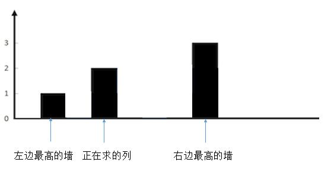

# 42-接雨水

## 给定 *n* 个非负整数表示每个宽度为 1 的柱子的高度图，计算按此排列的柱子，下雨之后能接多少雨水。


## 方法一：暴力法 - 按列求雨水

### 时间复杂度: O(n²) ，遍历每一列需要 n，找出左边最高和右边最高的墙加起来刚好又是一个 n，所以是 n²。

### 空间复杂度: O(1)

### 求每一列的水，我们只需要关注当前列，以及左边最高的墙，右边最高的墙就够了。

### 装水的多少，当然根据木桶效应，我们只需要看左边最高的墙和右边最高的墙中较矮的一个就够了。

### 所以，根据较矮的那个墙和当前列的墙的高度可以分为三种情况。

#### 1. 较矮的墙的高度大于当前列的墙的高度


#### 把正在求的列左边最高的墙和右边最高的墙确定后，然后为了方便理解，我们把无关的墙去掉。


#### 这样就很清楚了，现在想象一下，往两边最高的墙之间注水。正在求的列会有多少水？

#### 很明显，较矮的一边，也就是左边的墙的高度，减去当前列的高度就可以了，也就是 2 - 1 = 1，可以存一个单位的水。

#### 2. 较矮的墙的高度小于当前列的墙的高度


#### 同样，我们把其他无关的列去掉。



#### 正在求的列不会有水，因为它大于了两边较矮的墙。

#### 3. 较矮的墙的高度等于当前列的墙的高度。


#### 和上一种情况是一样的，不会有水。

```javascript
var trap = function (height) {
    if (height.length <= 2) return 0;
    let sum = 0;
    // 最两端的列不用考虑，因为一定不会有水。所以下标从 1 到 length - 2
    for (let i = 1; i < height.length - 1; i++) {
        // 找出左边最高
        let max_left = 0;
        for (let j = i - 1; j >= 0; j--) {
            if (height[j] > max_left) max_left = height[j];
        }
        // 找出右边最高
        let max_right = 0;
        for (let j = i + 1; j <= height.length - 1; j++) {
            if (height[j] > max_right) max_right = height[j];
        }
        // 找出两端较小的
        let min = Math.min(max_left, max_right);
        // 只有较小的一段大于当前列的高度才会有水，其他情况不会有水
        if (min > height[i]) sum += min - height[i];
    }
    return sum;
};
```


## 方法二：动态规划，优化方法1，空间换时间

### 时间复杂度：O(n)

### 空间复杂度：O(n)

我们注意到，解法二中。对于每一列，我们求它左边最高的墙和右边最高的墙，都是重新遍历一遍所有高度，这里我们可以优化一下。

首先用两个数组，max_left [i] 代表第 i 列左边最高的墙的高度，max_right[i] 代表第 i 列右边最高的墙的高度。（一定要注意下，第 i 列左（右）边最高的墙，是不包括自身的）

对于 max_left我们其实可以这样求。

max_left [i] = Max(max_left [i-1],height[i-1])。它前边的墙的左边的最高高度和它前边的墙的高度选一个较大的，就是当前列左边最高的墙了。

对于 max_right我们可以这样求。

max_right[i] = Max(max_right[i+1],height[i+1]) 。它后边的墙的右边的最高高度和它后边的墙的高度选一个较大的，就是当前列右边最高的墙了。

这样，我们再利用解法二的算法，就不用在 for 循环里每次重新遍历一次求 max_left 和 max_right 了。

```js
/**
 * @param {number[]} height
 * @return {number}
 */
var trap = function (height) {
    let len = height.length
    if (len < 3) return 0
    let sum = 0, //保存总水量
        left_max = new Array(len).fill(0), //保存每列的左边最高的墙
        right_max = new Array(len).fill(0) //保存每列的右边最高的墙
    //计算每列左边最高的墙，从第2列开始到倒数第2列结束，当前列最高的墙等于前一个墙高与前一个left_max数组的值中，两者取较大值
    for (let i = 1; i < len - 1; i++) {
        left_max[i] = Math.max(left_max[i - 1], height[i - 1])
    }
    //计算每列右边最高的墙，从第倒数第2列开始到第2列结束，当前列最高的墙等于后一个墙高与后一个right_max数组的值中，两者取较大值
    for (let i = len - 2; i > 0; i--) {
        right_max[i] = Math.max(right_max[i + 1], height[i + 1])
    }
    //下面还是方法1的思路
    for (let i = 1; i < len - 1; i++) {
        // 找出两端较小的
        let min = Math.min(left_max[i], right_max[i])
        // 只有较小的一段大于当前列的高度才会有水，其他情况不会有水
        if (min > height[i]) sum += min - height[i]
    }
    return sum
};
```


## 方法三：双指针

### 时间复杂度：O(n)
### 空间复杂度：O(1)


### 这里要明白一点，最开始的时候如果左边柱子从左往右是递增的，那么这些柱子是不能盛水的，比如像下面这样


### 同理最开始的时候如果右边的柱子从右往左是递增的，也是不能盛水的。所以上面图中right指向的是右边第2根柱子。

### 通过上面的计算，确定left和right的值之后，在left和right之间相当于构成了一个桶，桶的高度是最矮的那根柱子。然后我们从两边往中间逐个查找，如果查找的柱子高度小于桶的高度，那么盛水量就是桶的高度减去我们查找的柱子高度，如果查找的柱子大于桶的高度，我们要更新桶的高度。

```javascript
var trap = function (height) {
    if (height.length <= 2) return 0;
    let water = 0;
    let left = 0;
    let right = height.length - 1;
    //最开始的时候确定left和right的边界，这里的left和right是
    //柱子的下标，不是柱子的高度
    while (left < right && height[left] <= height[left + 1])
        left++;
    while (left < right && height[right] <= height[right - 1])
        right--;

    while (left < right) {
        let leftValue = height[left];
        let rightValue = height[right];
        //在left和right两根柱子之间计算盛水量
        if (leftValue <= rightValue) {
            //如果左边柱子高度小于等于右边柱子的高度，根据木桶原理，
            // 桶的高度就是左边柱子的高度
            while (left < right && leftValue >= height[++left]) {
                water += leftValue - height[left];
            }
        } else {
            //如果左边柱子高度大于右边柱子的高度，根据木桶原理，
            // 桶的高度就是右边柱子的高度
            while (left < right && rightValue >= height[--right]) {
                water += rightValue - height[right];
            }
        }
    }
    return water;
};
```

### while循环合并（推荐！）

```javascript
var trap = function (height) {
    if (height.length <= 2) return 0;
    let water = 0;
    let left = 0;
    let right = height.length - 1;
    let leftmax = 0;
    let rightmax = 0;
    while (left < right) {
        // 确定左边的最高柱子
        leftmax = Math.max(leftmax, height[left]);
        // 确定右边的最高柱子
        rightmax = Math.max(rightmax, height[right]);
        // 那么桶的高度就是leftmax和rightmax中最小的那个
        if (leftmax <= rightmax) {
            water += leftmax - height[left++];
        } else {
            water += rightmax - height[right--];
        }
    }
    return water;
};
```

### 标准写法

初始化 left 指针为 0 并且 right 指针为 size - 1

While left < right：

If height[left] < height[right]

​	If  height[left]  >  left_max,  更新 left_max

​	Else  累加  left_max − height[left] 到 water

​	left = left + 1

Else

​	If  height[right]  >  right_max,  更新 right_max

​	Else  累加  right_max − height[right]  到  water

​	right = right - 1

```javascript
var trap = function (height) {
    if (height.length < 3) return 0;
    let water = 0;
    let left = 0;
    let right = height.length - 1;
    let leftmax = 0;
    let rightmax = 0;
    while (left < right) {
        if (height[left] < height[right]) {
            if (height[left] > leftmax) {
                leftmax = height[left];
            } else {
                water += leftmax - height[left++];
            }
        } else {
            if (height[right] > rightmax) {
                rightmax = height[right];
            } else {
                water += rightmax - height[right--];
            }
        }
    }
    return water;
};
```


## 方法四：栈

### 时间复杂度：O(n)

### 空间复杂度：O(n)

### 我们用栈保存每堵墙。

### 当遍历墙的高度的时候，如果当前高度小于栈顶的墙高度，说明这里会有积水，我们将墙的高度的下标入栈。

### 如果当前高度大于栈顶的墙的高度，说明之前的积水到这里停下，我们可以计算下有多少积水了。计算完，栈内清空，就把当前的墙继续入栈，作为新的积水的墙。

### 总体的原则就是:

### 当前高度小于等于栈顶高度，入栈，指针后移。

### 当前高度大于栈顶高度，出栈，计算出当前墙和栈顶的墙之间水的多少，然后计算当前的高度和新栈的高度的关系，重复第 2 步。直到当前墙的高度不大于栈顶高度或者栈空，然后把当前墙入栈，指针后移。


```js
var trap = function (height) {
    if (height.length <= 2) return 0;
    let sum = 0;
    let cur = 0;
    let stack = [];
    //此处可用for
    while (cur < height.length) {
        // 如果栈不空并且当前指向的高度大于栈顶高度就一直循环
        while (stack.length && height[cur] > height[stack[stack.length - 1]]) {
            let top = stack.pop(); // 取出要出栈的元素(积水坑)
            if (!stack.length) break; // 栈空就出去
            let left = stack[stack.length - 1];
            let w = cur - left - 1; // 两堵墙之前的距离
            let h = Math.min(height[cur], height[left]) - height[top];
            sum += w * h;
        }
        stack.push(cur); // 当前指向的墙入栈
        cur++; // 指针后移
    }
    return sum;
};
```

