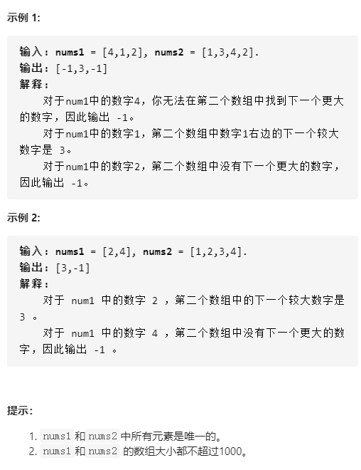

# 496-下一个更大元素 I

## 给定两个 没有重复元素 的数组 nums1 和 nums2 ，其中nums1 是 nums2 的子集。找到 nums1 中每个元素在 nums2 中的下一个比其大的值。

## nums1 中数字 x 的下一个更大元素是指 x 在 nums2 中对应位置的右边的第一个比 x 大的元素。如果不存在，对应位置输出 -1 。




## 方法一：暴力法

### 时间复杂度：O(n^2)

### 空间复杂度：O(n)

### 对于 nums1 的每个元素，在 nums2 中找到它，假设它的下标为 i ，那么从第 i + 1 位开始搜索是否存在比它大的，找到就将该值加入数组中，否则加入 -1

```javascript
var nextGreaterElement = function (nums1, nums2) {
    let res = new Array(nums1.length).fill(-1);
    for (let i = 0; i < nums1.length; i++) {
        let curIndex = nums2.indexOf(nums1[i]);
        for (let j = curIndex + 1; j < nums2.length; j++) {
            if (nums2[j] > nums1[i]) {
                res[i] = nums2[j];
                break;
            }
        }
    }
    return res;
};
```


## 方法二：单调栈 + 哈希映射（hashmap）

### 时间复杂度：O(n)

### 空间复杂度：O(n)

### 对于nums2的元素，维护一个单调不增的栈。依次扫描nums2的元素，假如扫到第 i 位，而且当前栈顶元素小于第 i 位元素，则栈顶元素找到了下一个比它大的元素。将其记录到哈希表中。否则将第i位元素入栈。

### 当扫描完nums2，留在栈中的元素都是没有比它大的元素存在的。最后，对于nums1的每个元素，依次查询哈希表即可得到他们的下一个更大元素

```javascript
var nextGreaterElement = function (nums1, nums2) {
    let res = [];
    let map = new Map();
    let st = [];
    for (let i = 0; i < nums2.length; i++) {
        let cur = nums2[i];
        while (st.length && cur > nums2[st[st.length - 1]]) {
            let pre = st.pop();
            map.set(nums2[pre], cur);
        }
        st.push(i);
    }
    while (st.length) {
        map.set(nums2[st.pop()], -1);
    }
    for (let n of nums1) {
        res.push(map.get(n));
    }
    return res;
};
```

