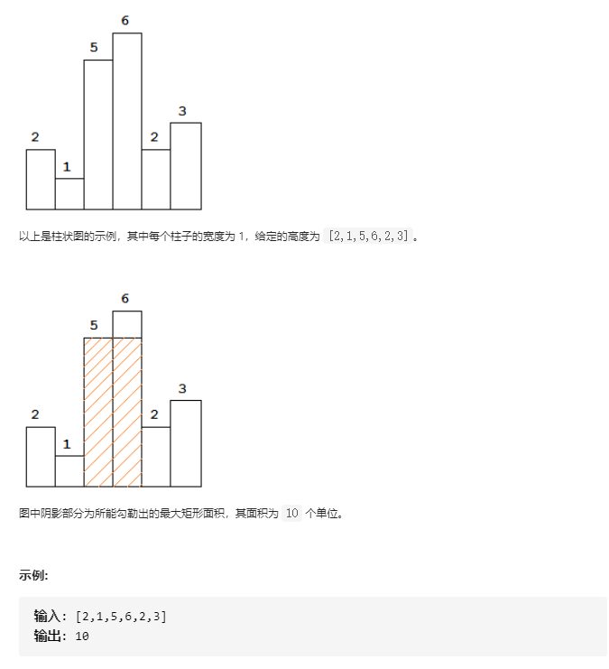
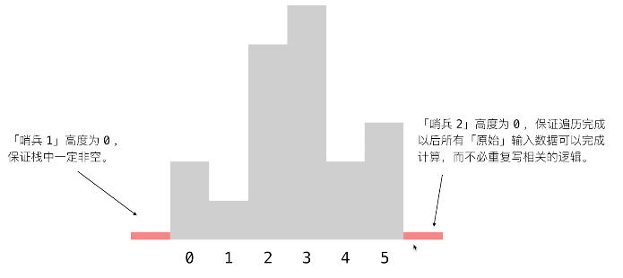

# 84-柱状图中最大的矩形

## 给定 *n* 个非负整数，用来表示柱状图中各个柱子的高度。每个柱子彼此相邻，且宽度为 1 。

## 求在该柱状图中，能够勾勒出来的矩形的最大面积。




## 方法一：暴力法 - 固定高，求最长底边

### 时间复杂度：O(n^2)

### 空间复杂度：O(1)

### 从 **i** 向两边遍历,找到左边和右边第1个严格小于height [i]的时候停下,中间的长度就是最长底边


```javascript
var largestRectangleArea = function (heights) {
    let n = heights.length;
    if (n == 0) {
    	return 0;
    }
    if (n == 1) {
    	return heights[0];
    }
    let maxArea = 0;
    for (let i = 0; i < n; i++) {
        let height = heights[i];
        let left = i;
        let right = i;
        while (left - 1 >= 0 && heights[left - 1] >= height) {
            left--;
        }
        while (right + 1 < n && heights[right + 1] >= height) {
            right++;
        }
        maxArea = Math.max(maxArea, (right - left + 1) * height);
    }
    return maxArea;
};
```


## 方法二：单调栈

### 时间复杂度：O(n)

### 空间复杂度：O(n)

###1.将元素入栈，当遇到待入栈元素小于栈顶时，就将栈中元素依次弹出，直到栈顶比入栈元素小为止。
###2.通过第一步的操作，就保证了栈是有小到大排序。
###3.当入栈元素比栈顶小时，入栈元素即为右边界，栈顶为高，栈顶的下一个元素为左边界，即可计算面积。
###4.当所有元素都完成入栈操作后，如果栈中还有元素，则需要以此将栈中元素依次弹出计算面积。
###5.在清空栈之前，栈顶为heights的最后一个元素，且栈是有小到大排序，因此栈中元素的右边界都为heights.length


```javascript
var largestRectangleArea = function (heights) {
    let n = heights.length;
    if (n == 0) {
        return 0;
    }
    if (n == 1) {
        return heights[0];
    }
    let maxArea = 0;
    let st = [];
    for (let i = 0; i < n; i++) {
        while (st.length && heights[st[st.length - 1]] > heights[i]) {
            let height = heights[st.pop()];
            while (st.length && heights[st[st.length - 1]] == height) {
                st.pop();
            }
            let width = 0;
            if (st.length) {
                width = i - st[st.length - 1] - 1;
            } else {
                width = i;
            }
            maxArea = Math.max(maxArea, width * height);
        }
        st.push(i);
    }
    while (st.length) {
        let height = heights[st.pop()];
        while (st.length && heights[st[st.length - 1]] == height) {
            st.pop();
        }
        let width = 0;
        if (st.length) {
            width = n - st[st.length - 1] - 1;
        } else {
            width = n;
        }
        maxArea = Math.max(maxArea, width * height);
    }
    return maxArea;
};
```


## 方法三：单调栈 + 常数优化 ( 加哨兵 )

### 时间复杂度：O(n)

### 空间复杂度：O(n)

### 有了这两个柱形：左边的柱形（第 1 个柱形）由于它一定比输入数组里任何一个元素小，它肯定不会出栈，因此栈一定不会为空；右边的柱形（第 2 个柱形）也正是因为它一定比输入数组里任何一个元素小，它会让所有输入数组里的元素出栈（第 1 个哨兵元素除外）。




```javascript
var largestRectangleArea = function (heights) {
    let n = heights.length;
    if (n == 0) return 0;
    if (n == 1) return heights[0];
    let maxArea = 0;
    heights = [0, ...heights, 0];
    n += 2;
    // 有哨兵，在循环里就不用做非空判断
    let st = [0];
    for (let i = 1; i < n; i++) {
        while (heights[st[st.length - 1]] > heights[i]) {
            let height = heights[st.pop()];
            // 相邻的相同元素处理可保存也可去除
            // while (heights[st[st.length - 1]] == height) {
                // st.pop();
            // }
            let width = i - st[st.length - 1] - 1;
            maxArea = Math.max(maxArea, width * height);
        }
        st.push(i);
    }
    return maxArea;
};
```