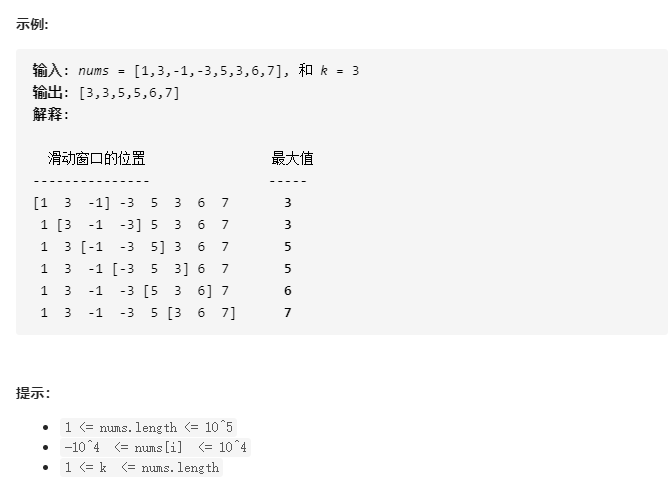
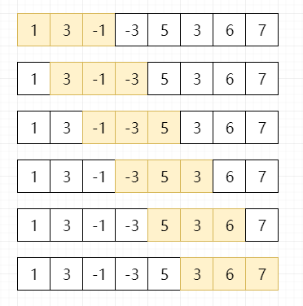
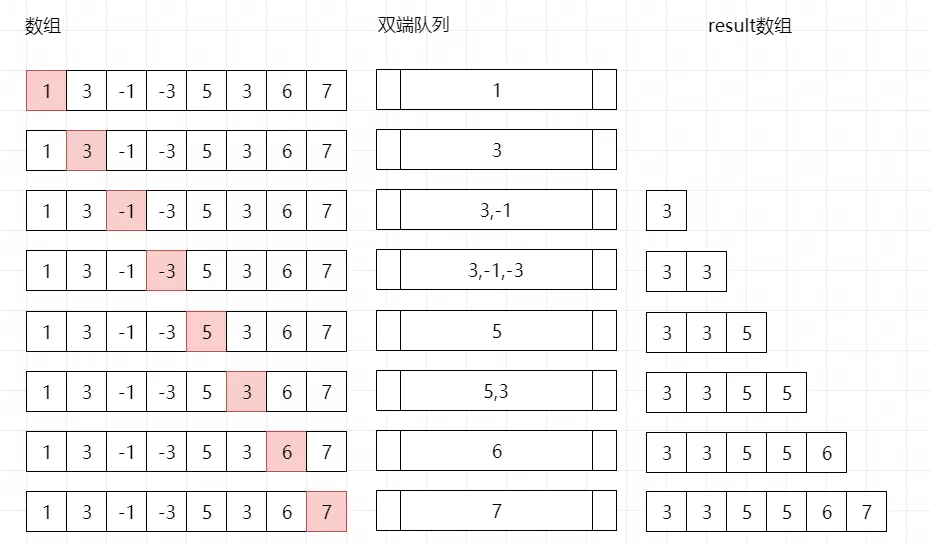

# 239-滑动窗口最大值

### 给定一个数组 nums，有一个大小为 k 的滑动窗口从数组的最左侧移动到数组的最右侧。你只可以看到在滑动窗口内的 k 个数字。滑动窗口每次只向右移动一位。

### 返回滑动窗口中的最大值。

### 进阶：你能在线性时间复杂度 O(n) 内解决此题吗？




## 方法一：暴力法

### 时间复杂度：O(n*k)

### 空间复杂度：O(n)

### 一共有 **N - k + 1** 个滑动窗口，每个有 **k** 个元素。

### 1. 遍历每个滑块的起始点。

### 2. 从起始点开始，遍历后续滑块元素。

### 3. 对比滑块中元素的最大值，并存入结果。



```javascript
var maxSlidingWindow = function (nums, k) {
    let n = nums.length;
    if (k == 1) return nums;
    let out = [];
    for (let i = 0; i < n - k + 1; i++) {
        let max = Number.MIN_VALUE;
        // 找到每一个滑动窗口的最大值
        for (let j = i; j < i + k; j++) {
            max = Math.max(max, nums[j]);
        }
        out.push(max);
    }
    return out;
};

// 写法2
var maxSlidingWindow = function (nums, k) {
    let n = nums.length;
    if (k == 1) return nums;
    let out = [];
    for (let i = 0; i < n - k + 1; i++) {
        let max = nums[i];
        for (let j = i + 1; j < i + k; j++) {
            max = Math.max(max, nums[j]);
        }
        out.push(max);
    }
    return out;
};

// 写法3
var maxSlidingWindow = function (nums, k) {
    let n = nums.length;
    if (k == 1) return nums;
    let res = [];
    for (let i = 0; i < n - k + 1; i++) {
        let max = Math.max(...nums.slice(i, i + k));
        res.push(max);
    }
    return res;
};
```


## 方法二：单调双端队列

### 时间复杂度：O(n)

### 空间复杂度：O(n)

### 核心思路：维护一个单调双端队列，队头元素到队尾元素依次递减，然后最大值就是队列中的第一个元素

### 1. 比较当前元素 i 和双端队列第一个元素（索引值）相差 >= k 时，队首出列，即滑动窗口外的元素删掉。

### 2. 依次比较双端队列的队尾与当前元素 i 对应的值，队尾元素值较小时出列，直至不小于当前元素 i 的值时，或者队列为空，这是为了保证当队头出队时，新的队头依旧是最大值，即形成单调递减队列。

### 3. 当前元素入队。

### 4. 从第 K 次遍历开始，依次把最大值（双端队列的队头）添加到结果 result 中。



```javascript
var maxSlidingWindow = function (nums, k) {
    if (k == 1) return nums;
    let win = [];
    let res = [];
    for (let i = 0; i < nums.length; i++) {
        if (i - win[0] >= k) win.shift();
        while (nums[win[win.length - 1]] <= nums[i]) win.pop();
        win.push(i);
        if (i >= k - 1) res.push(nums[win[0]]);
    }
    return res;
};

// 优化版
var maxSlidingWindow = function (nums, k) {
    if (k == 1) return nums;
    let win = [];
    let res = [];
    for (let i = 0; i < nums.length; i++) {
        if (win.length && i - win[0] >= k) win.shift(); // 在滑动窗口之外的直接从队头删掉
        // 如果新加进来的数比单调队列中原来的数都要大，则直接弹出队列中的其他数
        while (win.length && nums[win[win.length - 1]] <= nums[i]) win.pop();
        win.push(i);
        // 数组下标从0开始，k=3时 ，下标为0，1，2的数组元素构成一个滑动窗口，所以条件为i>=k-1就可以将答案存入res中
        if (i >= k - 1) res.push(nums[win[0]]);
    }
    return res;
};
```

