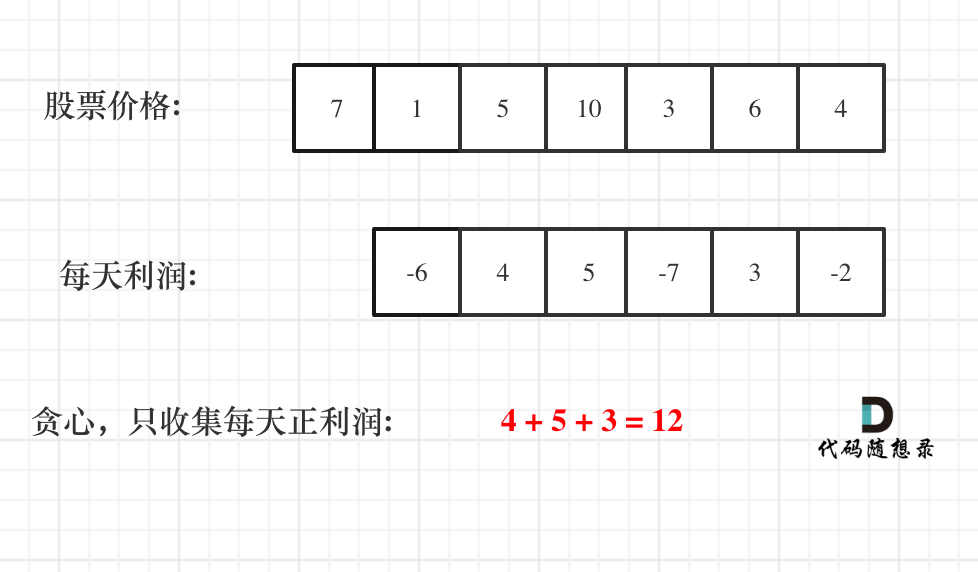

# 122-买卖股票的最佳时机 II

### 给定一个数组，它的第 i 个元素是一支给定股票第 i 天的价格。

### 设计一个算法来计算你所能获取的最大利润。你可以尽可能地完成更多的交易（多次买卖一支股票）。

### 注意：你不能同时参与多笔交易（你必须在再次购买前出售掉之前的股票）。

#### 示例 1:

```
输入: [7,1,5,3,6,4]
输出: 7
解释: 在第 2 天（股票价格 = 1）的时候买入，在第 3 天（股票价格 = 5）的时候卖出,
这笔交易所能获得利润 = 5-1 = 4。随后，在第 4 天（股票价格 = 3）的时候买入，
在第 5 天（股票价格 = 6）的时候卖出, 这笔交易所能获得利润 = 6-3 = 3。
```

#### 示例 2:

```
输入: [1,2,3,4,5]
输出: 4
解释: 在第 1 天（股票价格 = 1）的时候买入，在第 5 天 （股票价格 = 5）的时候卖出, 这笔交易所能获得利润 = 5-1 = 4 。
注意你不能在第 1 天和第 2 天接连购买股票，之后再将它们卖出。
因为这样属于同时参与了多笔交易，你必须在再次购买前出售掉之前的股票。
```

#### 示例 3:

```
输入: [7,6,4,3,1]
输出: 0
解释: 在这种情况下, 没有交易完成, 所以最大利润为 0。
```

#### 提示：

- 1 <= prices.length <= 3 * 10 ^ 4
- 0 <= prices[i] <= 10 ^ 4


#### 思路：

本题首先要清楚两点：

- 只有一只股票！
- 当前只有买股票或者买股票的操作

想获得利润至少要两天为一个交易单元。


## 方法一：贪心算法

### 时间复杂度O(n)

### 空间复杂度O(1)

这道题目可能我们只会想，选一个低的买入，在选个高的卖，在选一个低的买入.....循环反复。

**「如果想到其实最终利润是可以分解的，那么本题就很容易了！」**

如果分解呢？

假如第0天买入，第3天卖出，那么利润为：prices[3] - prices[0]。

相当于(prices[3] - prices[2]) + (prices[2] - prices[1]) + (prices[1] - prices[0])。

**「此时就是把利润分解为每天为单位的维度，而不是从0天到第3天整体去考虑！」**

那么根据prices可以得到每天的利润序列：(prices[i] - prices[i - 1]).....(prices[1] - prices[0])。

一些同学陷入：第一天怎么就没有利润呢，第一天到底算不算的困惑中。

第一天当然没有利润，至少要第二天才会有利润，所以利润的序列比股票序列少一天！

从图中可以发现，其实我们需要收集每天的正利润就可以，**「收集正利润的区间，就是股票买卖的区间，而我们只需要关注最终利润，不需要记录区间」**。

那么只收集正利润就是贪心所贪的地方！



**「局部最优：收集每天的正利润，全局最优：求得最大利润」**。

局部最优可以推出全局最优，找不出反例，试一试贪心！

```js
//此题可买卖无数次是贪心的关键
var maxProfit = function (prices) {
    if (prices == null || prices.length < 2) return 0
    let res = 0;
    //从第二天开始
    for (let i = 1; i < prices.length; i++) {
        //只收集正利润
        res += Math.max(prices[i] - prices[i - 1], 0);
    }
    return res;
};
```

