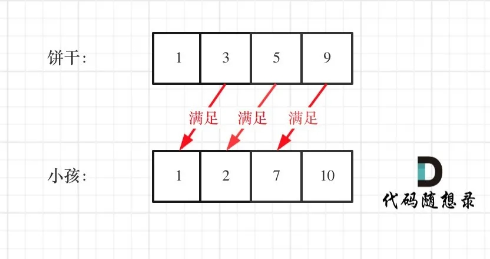

# 455-分发饼干

### 假设你是一位很棒的家长，想要给你的孩子们一些小饼干。但是，每个孩子最多只能给一块饼干。

### 对每个孩子 i，都有一个胃口值 g[i]，这是能让孩子们满足胃口的饼干的最小尺寸；并且每块饼干 j，都有一个尺寸 s[j] 。如果 s[j] >= g[i]，我们可以将这个饼干 j 分配给孩子 i ，这个孩子会得到满足。你的目标是尽可能满足越多数量的孩子，并输出这个最大数值。

#### 示例 1:

```
输入: g = [1,2,3], s = [1,1]
输出: 1
解释:
你有三个孩子和两块小饼干，3个孩子的胃口值分别是：1,2,3。
虽然你有两块小饼干，由于他们的尺寸都是1，你只能让胃口值是1的孩子满足。
所以你应该输出1。
```

#### 示例 2:

```
输入: g = [1,2], s = [1,2,3]
输出: 2
解释:
你有两个孩子和三块小饼干，2个孩子的胃口值分别是1,2。
你拥有的饼干数量和尺寸都足以让所有孩子满足。
所以你应该输出2。
```

#### 提示：

- 1 <= g.length <= 3 * 104
- 0 <= s.length <= 3 * 104
- 1 <= g[i], s[j] <= 231 - 1


## 方法一：排序 + 贪心算法

### 时间复杂度O(n)

### 空间复杂度O(1)

为了了满足更多的小孩，就不要造成饼干尺寸的浪费。

大尺寸的饼干既可以满足胃口大的孩子也可以满足胃口小的孩子，那么就应该优先满足胃口大的。

**「这里的局部最优就是大饼干喂给胃口大的，充分利用饼干尺寸喂饱一个，全局最优就是喂饱尽可能多的小孩」**。

可以尝试使用贪心策略，先将饼干数组和小孩数组排序。

然后从后向前遍历小孩数组，用大饼干优先满足胃口大的，并统计满足小孩数量。



这个例子可以看出饼干9只有喂给胃口为7的小孩，这样才是整体最优解，并想不出反例，那么就可以撸代码了。

```js
var findContentChildren = function (g, s) {
    let res = 0;
    g.sort((a, b) => a - b);
    s.sort((a, b) => a - b);
    let index = s.length - 1;
    for (i = g.length - 1; i >= 0; i--) {
        if (index >= 0 && s[index] >= g[i]) {
            res++;
            index--;
        }
    }
    return res;
};
```

#### 小技巧

从代码中可以看出我用了一个index来控制饼干数组的遍历，遍历饼干并没有再起一个for循环，而是采用自减的方式，这也是常用的技巧。

有的同学看到要遍历两个数组，就想到用两个for循环，那样逻辑其实就复杂了。