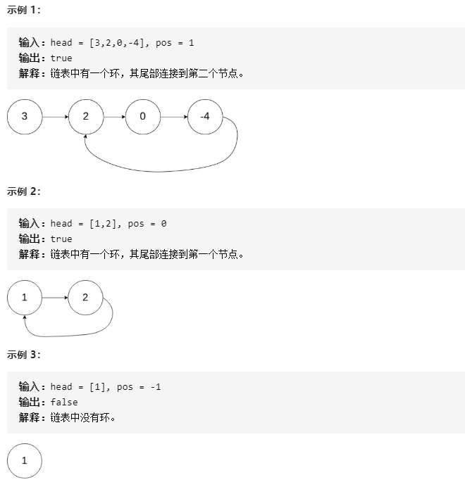

# 141-环形链表

给定一个链表，判断链表中是否有环。

为了表示给定链表中的环，我们使用整数 **pos** 来表示链表尾连接到链表中的位置（索引从 0 开始）。 

如果 **pos** 是  **-1** ，则在该链表中没有环。




## 方法一：使用哈希表

### 时间复杂度：O(n)，对于含有 n 个元素的链表，我们访问每个元素最多一次。添加一个结点到哈希表中只需要花费 O(1) 的时间。

### 空间复杂度：O(n)，空间取决于添加到哈希表中的元素数目，最多可以添加 n 个元素。

```javascript
var hasCycle = function (head) {
    let map = new Map();
    while (head) {  // 即 head != null
        if (map.has(head)) return true;
        map.set(head, true);
        head = head.next;
    }
    return false;
};
```


## 方法二：标记法

### 时间复杂度：O(n)。

### 空间复杂度：O(1)。

```javascript
var hasCycle = function (head) {
    while (head) {  // 即 head != null
        if (head.repeat) return true;
        //给ListNode对象加一个repeat属性
        head.repeat = true;
        head = head.next;
    }
    return false;
};
```


## 方法三：快慢双指针 (重点！)

### 时间复杂度：O(n)，n 设为链表中结点的总数。

### 空间复杂度：O(1)，我们只使用了慢指针和快指针两个结点，所以空间复杂度为 O(1)。

```javascript
var hasCycle = function (head) {
    let fast = head;
    let slow = head;
    while (fast && fast.next) {
        slow = slow.next;
        fast = fast.next.next;
        if (fast == slow) return true;
    }
    return false;
};
```