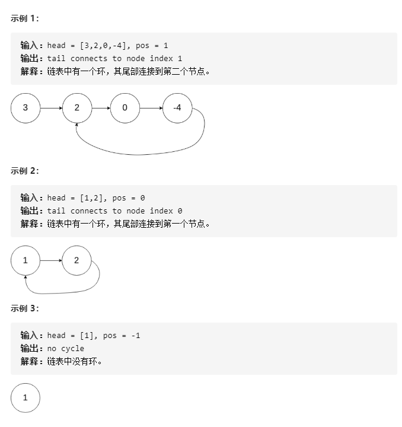

# 142-环形链表 II

给定一个链表，返回链表开始入环的第一个节点。 如果链表无环，则返回 **null**。

为了表示给定链表中的环，我们使用整数 **pos** 来表示链表尾连接到链表中的位置（索引从 0 开始）。 如果 **pos** 是 **-1**，则在该链表中没有环。

**说明：**不允许修改给定的链表。




## 方法一：使用哈希表

### 时间复杂度：O(n)

### 空间复杂度：O(n)

```javascript
var detectCycle = function (head) {
    var map = new Map();
    while (head) {
        if (map.has(head)) return head;
        map.set(head, head);
        head = head.next;
    }
    return null;
};
```


## 方法二：使用Set集合

### 时间复杂度：O(n)

### 空间复杂度：O(n)

```javascript
var detectCycle = function (head) {
    var setl = new Set();
    while (head) {
        if (setl.has(head)) return head;
        setl.add(head);
        head = head.next;
    }
    return null;
};
```


## 方法三：Floyd 算法 (快慢双指针升级版)

### 时间复杂度：O(n)

### 空间复杂度：O(1)

**详细讲解：**

https://mp.weixin.qq.com/s?__biz=MzUxNjY5NTYxNA==&mid=2247488853&idx=2&sn=f35789bdd87ec7f87d31f9a844ba8699&scene=21#wechat_redirect

```javascript
// 推荐！
var detectCycle = function (head) {
    let fast = head;
    let slow = head;
    while (fast && fast.next) {
        slow = slow.next;
        fast = fast.next.next;
        if (fast == slow) {
            fast = head;
            while (fast != slow) {
                fast = fast.next;
                slow = slow.next;
            }
            return fast;
        }
    }
    return null;
};


// 修改版 (了解)
var detectCycle = function (head) {
    if (!head) {
        return null;
    }
    let fast = head;
    let slow = head;
    while (true) {
        if (fast == null || fast.next == null) {
            return null;
        }
        slow = slow.next;
        fast = fast.next.next;
        if (fast == slow) break;
    }
    fast = head;
    while (fast != slow) {
        fast = fast.next;
        slow = slow.next;
    }
    return fast;
};
```


