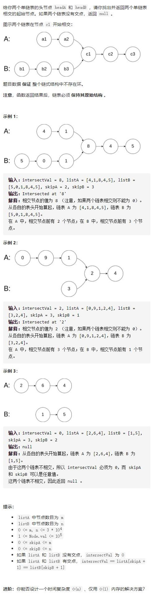

# 160-相交链表




## 方法1：哈希表

**时间复杂度：O(n)**

**空间复杂度：O(n)**

只有当链表 headA 和 headB 都不为空时，两个链表才可能相交。因此首先判断链表 headA 和 headB 是否为空，如果其中至少有一个链表为空，则两个链表一定不相交，返回 null。

首先遍历链表 headA，并将链表 headA 中的每个节点加入哈希集合中。然后遍历链表 headB，对于遍历到的每个节点，判断该节点是否在哈希集合中：

如果当前节点不在哈希集合中，则继续遍历下一个节点；

如果当前节点在哈希集合中，则后面的节点都在哈希集合中，即从当前节点开始的所有节点都在两个链表的相交部分，因此在链表 headB 中遍历到的第一个在哈希集合中的节点就是两个链表相交的节点，返回该节点。

如果链表 headB 中的所有节点都不在哈希集合中，则两个链表不相交，返回 null。

```js
/**
 * Definition for singly-linked list.
 * function ListNode(val) {
 *     this.val = val;
 *     this.next = null;
 * }
 */

/**
 * @param {ListNode} headA
 * @param {ListNode} headB
 * @return {ListNode}
 */
var getIntersectionNode = function (headA, headB) {
    if (!headA || !headB) return null
    let s = new Set()
    let temp = headA
    while (temp) {
        s.add(temp)
        temp = temp.next
    }
    temp = headB
    while (temp) {
        if (s.has(temp)) return temp
        temp = temp.next
    }
    return null
};
```


## 方法2：双指针-a链表到末尾去b链表头部，b去a，最终会相遇

**时间复杂度：O(n)**

**空间复杂度：O(1)**

使用双指针的方法，可以将空间复杂度降至 O(1)。

只有当链表 headA 和 headB 都不为空时，两个链表才可能相交。因此首先判断链表 headA 和 headB 是否为空，如果其中至少有一个链表为空，则两个链表一定不相交，返回 null。

当链表 headA 和 headB 都不为空时，创建两个指针 pA 和 pB，初始时分别指向两个链表的头节点 headA 和 headB，然后将两个指针依次遍历两个链表的每个节点。具体做法如下：

每步操作需要同时更新指针 pA 和 pB；

如果指针 pA 不为空，则将指针 pA 移到下一个节点；如果指针 pB 不为空，则将指针 pB 移到下一个节点。

如果指针 pA 为空，则将指针 pA 移到链表 headB 的头节点；如果指针 pB 为空，则将指针 pB 移到链表 headA 的头节点。

当指针 pA 和 pB 指向同一个节点或者都为空时，返回它们指向的节点或者 null。


```js
/**
 * Definition for singly-linked list.
 * function ListNode(val) {
 *     this.val = val;
 *     this.next = null;
 * }
 */

/**
 * @param {ListNode} headA
 * @param {ListNode} headB
 * @return {ListNode}
 */
//双指针-a链表到末尾去b链表头部，b去a，最终会相遇
var getIntersectionNode = function (headA, headB) {
    if (!headA || !headB) return null
    let pA = headA,
        pB = headB
    while (pA != pB) {
        pA = pA === null ? headB : pA.next
        pB = pB === null ? headA : pB.next
    }
    return pA
};
```

