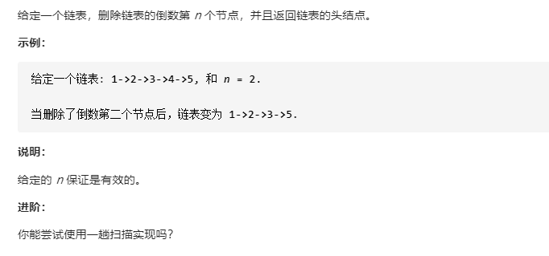

# 19-删除链表的倒数第N个节点




## 方法一：2次遍历法

### 时间复杂度：O(n)

### 空间复杂度：O(1)

### 思路

#### 我们注意到这个问题可以容易地简化成另一个问题：删除从列表开头数起的第 (L - n + 1) 个结点，其中 L 是列表的长度。只要我们找到列表的长度 L，这个问题就很容易解决。

### 算法

#### 首先我们将添加一个哑结点作为辅助，该结点位于列表头部。哑结点用来简化某些极端情况，例如列表中只含有一个结点，或需要删除列表的头部。在第一次遍历中，我们找出列表的长度 L。然后设置一个指向哑结点的指针，并移动它遍历列表，直至它到达第 (L - n) 个结点那里。我们把第 (L - n) 个结点的 next 指针重新链接至第 (L - n + 2) 个结点，完成这个算法。


```javascript
/**
 * Definition for singly-linked list.
 * function ListNode(val, next) {
 *     this.val = (val===undefined ? 0 : val)
 *     this.next = (next===undefined ? null : next)
 * }
 */
/**
 * @param {ListNode} head
 * @param {number} n
 * @return {ListNode}
 */
var removeNthFromEnd = function (head, n) {
    if (head == null) return null;
    let prehead = new ListNode(-1);
    prehead.next = head;
    if (head.next == null) {
        prehead.next = head.next;
        return prehead.next;
    }
    let length = 0;
    let p = head;
    while (p != null) {
        length++;
        p = p.next;
    }
    p = prehead;
    length -= n;
    while (length > 0) {
        length--;
        p = p.next;
    }
    p.next = p.next.next;
    return prehead.next;
};
```


## 方法二：1次遍历法 双指针

### 时间复杂度：O(n)

### 空间复杂度：O(1)

### 算法

#### 上述算法可以优化为只使用一次遍历。我们可以使用两个指针而不是一个指针。第一个指针从列表的开头向前移动 n+1 步，而第二个指针将从列表的开头出发。现在，这两个指针被 n 个结点分开。我们通过同时移动两个指针向前来保持这个恒定的间隔，直到第一个指针到达最后一个结点。此时第二个指针将指向从最后一个结点数起的第 n 个结点。我们重新链接第二个指针所引用的结点的 next 指针指向该结点的下下个结点。


```javascript
/**
 * Definition for singly-linked list.
 * function ListNode(val, next) {
 *     this.val = (val===undefined ? 0 : val)
 *     this.next = (next===undefined ? null : next)
 * }
 */
/**
 * @param {ListNode} head
 * @param {number} n
 * @return {ListNode}
 */
var removeNthFromEnd = function (head, n) {
    if (head == null) return null;
    let prehead = new ListNode(-1); //虚拟节点
    prehead.next = head;
    //if (head.next == null) {
    //    prehead.next = head.next;
    //    return prehead.next;
    //}
    let p1 = prehead; //快指针
    let p2 = prehead; //慢指针
    for (let i = 0; i < n + 1; i++) {
        p1 = p1.next;
    }
    while (p1 != null) {
        p1 = p1.next;
        p2 = p2.next;
    }
    p2.next = p2.next.next;
    return prehead.next;
};
```

