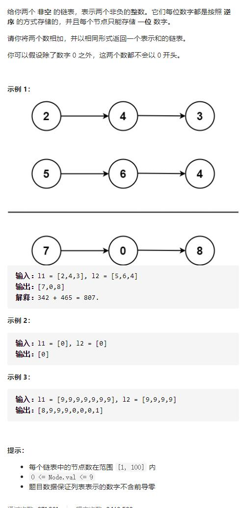

# 2-两数相加




## 方法1：虚拟头结点 + 双指针遍历 + 进位处理 + 优化补0

思路同字符串相加！！！

```js
/**
 * Definition for singly-linked list.
 * function ListNode(val, next) {
 *     this.val = (val===undefined ? 0 : val)
 *     this.next = (next===undefined ? null : next)
 * }
 */
/**
 * @param {ListNode} l1
 * @param {ListNode} l2
 * @return {ListNode}
 */
// 写法1：单独处理计算完后的进度问题
var addTwoNumbers = function (l1, l2) {
    let pre = new ListNode(0), //注意添加前置指针当头指针，用于返回
        cur = pre
    let add = 0
    while (l1 || l2) {
        let n1 = l1 ? l1.val : 0
        let n2 = l2 ? l2.val : 0
        let sum = n1 + n2 + add
        cur.next = new ListNode(sum % 10)
        add = Math.floor(sum / 10)
        cur = cur.next
        if (l1) l1 = l1.next
        if (l2) l2 = l2.next
    }
    if (add != 0) cur.next = new ListNode(add)
    return pre.next
};

// 写法2：统一处理2个数是否遍历到头，计算完后的进度问题
var addTwoNumbers = function (l1, l2) {
    let pre = new ListNode(0),
        cur = pre //当前移动节点
    let add = 0
    while (l1 || l2 || add != 0) {
        let n1 = l1 ? l1.val : 0
        let n2 = l2 ? l2.val : 0
        let sum = n1 + n2 + add
        cur.next = new ListNode(sum % 10)
        add = Math.floor(sum / 10)
        cur = cur.next
        if (l1) l1 = l1.next
        if (l2) l2 = l2.next
    }
    return pre.next
};
```


