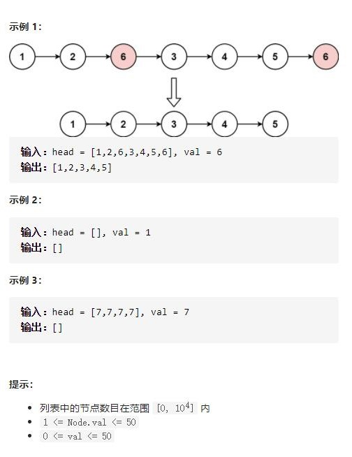

# 203-移除链表元素

给你一个链表的头节点 `head` 和一个整数 `val` ，请你删除链表中所有满足 `Node.val == val` 的节点，并返回 **新的头节点** 。




## 方法1：递归

时间复杂度：O(n)

空间复杂度：O(n)

```js
/**
 * Definition for singly-linked list.
 * function ListNode(val, next) {
 *     this.val = (val===undefined ? 0 : val)
 *     this.next = (next===undefined ? null : next)
 * }
 */
/**
 * @param {ListNode} head
 * @param {number} val
 * @return {ListNode}
 */
var removeElements = function (head, val) {
    if (head === null) {
        return head
    }
    head.next = removeElements(head.next, val)
    return head.val === val ? head.next : head
};
```


## 方法2：迭代-使用哨兵节点

时间复杂度：O(n)

空间复杂度：O(1)

```js
/**
 * Definition for singly-linked list.
 * function ListNode(val, next) {
 *     this.val = (val===undefined ? 0 : val)
 *     this.next = (next===undefined ? null : next)
 * }
 */
/**
 * @param {ListNode} head
 * @param {number} val
 * @return {ListNode}
 */
var removeElements = function (head, val) {
    let h0 = new ListNode(0) //设置哨兵节点（虚拟节点）
    h0.next = head
    let cur = h0
    while(cur.next != null){
    //while(cur && cur.next){
        if(cur.next.val === val){
            cur.next = cur.next.next
        }else{
            cur = cur.next
        }
    }
    return h0.next
};
```


