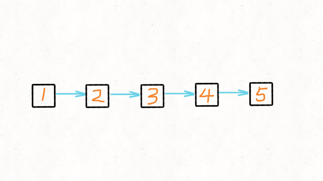

# 206-反转链表   双指针迭代/递归

反转一个单链表。

**示例:**

```
输入: 1->2->3->4->5->NULL
输出: 5->4->3->2->1->NULL
```


## (推荐！）方法一：双指针迭代

### 时间复杂度：O(n)，n 是列表的长度。

### 空间复杂度：O(1)。




```javascript
/**
 * Definition for singly-linked list.
 * function ListNode(val, next) {
 *     this.val = (val===undefined ? 0 : val)
 *     this.next = (next===undefined ? null : next)
 * }
 */
/**
 * @param {ListNode} head
 * @return {ListNode}
 */
// 常规迭代
var reverseList = function (head) {
    // if (!head || !head.next) return head;
    
    let pre = null; //虚拟头指针
    let cur = head;
    while (cur != null) {
        let temp = cur.next; //缓存下一个节点
        cur.next = pre;
        pre = cur;
        cur = temp;
    }
    return pre;
};

// ES6简化版
var reverseList = function (head) {
    let [pre, cur] = [null, head]
    while (cur) {
        let temp = cur.next;
        [cur.next, pre, cur] = [pre, cur, temp];
        
        // 或 [curr.next, prev, curr] = [prev, curr, curr.next];
    }
    return pre;
};
```


### 双指针迭代2  -  非常规迭代（了解）

#### 时间复杂度：O(n)，n 是列表的长度。

#### 空间复杂度：O(1)。


```javascript
// 非常规迭代
var reverseList = function (head) {
    if (head == null) return null;
    let cur = head;
    while (head.next != null) {
        let temp = head.next.next;
        head.next.next = cur;
        cur = head.next;
        head.next = temp;
    }
    return cur;
};
```


## 方法二：递归-从后前翻

### 时间复杂度: O(n). 从最底层两个节点反转开始，每层时间复杂度均为 O(1), 总共 n-1 层递归，故时间复杂度为 O(n).

### 空间复杂度: O(n). 递归调用栈消耗空间，共 n-1 层递归，故空间复杂度为 O(n).


```javascript
// 递归
var reverseList = function (head) {
    if (head == null || head.next == null) {
        return head;
    }
    let cur = reverseList(head.next); //传递返回末尾节点，最后当头结点返回，无其他作用
    head.next.next = head;
    head.next = null;
    return cur;
};

// 简化版
var reverseList = function (head) {
    if (!head || !head.next) return head;
    let cur = reverseList(head.next); //传递返回末尾节点，最后当头结点返回，无其他作用
    head.next.next = head;
    head.next = null;
    return cur;
};

```

