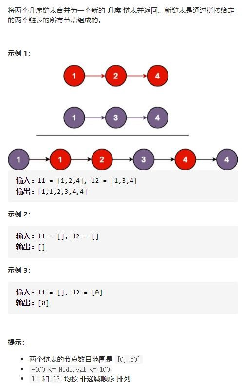
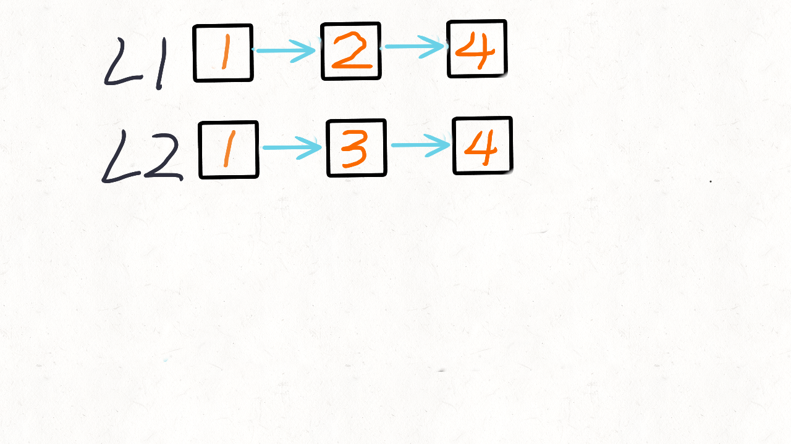
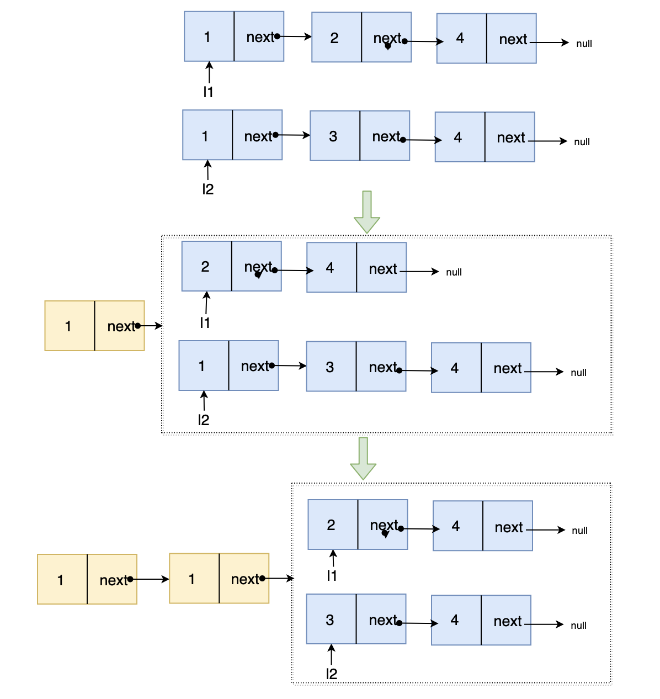

# 21-合并两个有序链表




## 方法一：双指针迭代

当 l1 和 l2 都不是空链表时，判断 l1 和 l2 哪一个链表的头节点的值更小，将较小值的节点添加到结果里，当一个节点被添加到结果里之后，将对应链表中的节点向后移一位。

### 时间复杂度：O(n + m)

### 空间复杂度：O(1)

```javascript
var mergeTwoLists = function (l1, l2) {
    let prehead = new ListNode(-1);
    let pre = prehead;
    while (l1 != null && l2 != null) {
        if (l1.val <= l2.val) {
            pre.next = l1;
            l1 = l1.next;
        } else {
            pre.next = l2;
            l2 = l2.next;
        }
        pre = pre.next;
    }
    pre.next = l1 == null ? l2 : l1;
    return prehead.next;
};


/**
 * Definition for singly-linked list.
 * function ListNode(val, next) {
 *     this.val = (val===undefined ? 0 : val)
 *     this.next = (next===undefined ? null : next)
 * }
 */
/**
 * @param {ListNode} l1
 * @param {ListNode} l2
 * @return {ListNode}
 */
var mergeTwoLists = function (l1, l2) {
    let prehead = new ListNode(0),
        pre = prehead
    while (l1 && l2) {
        if (l1.val <= l2.val) {
            pre.next = l1
            l1 = l1.next
        } else {
            pre.next = l2
            l2 = l2.next
        }
        pre = pre.next
    }
    pre.next = l1 ? l1 : l2
    return prehead.next
};
```


## 方法二：递归

### 终止条件：当两个链表 l1  和 l2 都为空时，表示我们对链表已合并完成。

### **如何递归：**我们判断 l1 和 l2 头结点哪个更小，然后较小结点的 next 指针指向其余结点的合并结果。（调用递归）

### 返回值：每一层调用都返回排序好的链表头

### 时间复杂度：O(n + m)

### 空间复杂度：O(n + m)





```javascript
var mergeTwoLists = function (l1, l2) {
    if (l1 == null) {
        return l2;
    }
    if (l2 == null) {
        return l1;
    }
    if (l1.val <= l2.val) {
        l1.next = mergeTwoLists(l1.next, l2);
        return l1;
    } else {
        l2.next = mergeTwoLists(l1, l2.next);
        return l2;
    }
};
```


