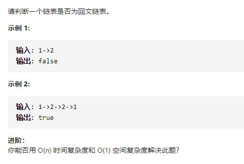

# 234-回文链表




## 方法1：将值复制到数组中后用双指针法

1.复制链表值到数组列表中。

2.使用双指针法判断是否为回文。

```js
/**
 * Definition for singly-linked list.
 * function ListNode(val, next) {
 *     this.val = (val===undefined ? 0 : val)
 *     this.next = (next===undefined ? null : next)
 * }
 */
/**
 * @param {ListNode} head
 * @return {boolean}
 */
var isPalindrome = function (head) {
    let list = []
    while (head) {
        list.push(head.val)
        head = head.next
    }
    let l = 0,
        r = list.length - 1
    while (l < r) {
        if (list[l] !== list[r]) return false
        l++
        r--
    }
    return true
};
```


## 方法2：快慢指针+反转后半部分链表+分割链表+判断回文

1.找到前半部分链表的尾节点。

2.反转后半部分链表。

3.判断是否回文。

4.返回结果。

详细：

1）用快慢指针，快指针有两步，慢指针走一步，快指针遇到终止位置时，慢指针就在链表中间位置

2）同时用pre记录慢指针指向节点的前一个节点，用来分割链表

3）将链表分为前后均等两部分，如果链表长度是奇数，那么后半部分多一个节点

4）将后半部分反转 ，得cur2，前半部分为cur1

5）按照cur1的长度，一次比较cur1和cur2的节点数值

```js
var isPalindrome = function (head) {
    //注意排除null和单个元素的链表
    if (!head || !head.next) return true
    let slow = head
    let fast = head
    let pre = head
    //找到前半部分链表的尾节点
    while (fast && fast.next) {
        pre = slow
        slow = slow.next
        fast = fast.next.next
    }
    //分割链表
    pre.next = null
    let cur1 = head
    //反转后半部分链表
    let cur2 = reverse(slow)
    function reverse(head) {
        let pre = new ListNode(0)
        pre.next = head
        let cur = head
        let tmp
        while (cur) {
            tmp = cur.next
            cur.next = pre
            pre = cur
            cur = tmp
        }
        return pre
    }
    //判断回文
    while (cur1) {
        if (cur1.val !== cur2.val) return false
        cur1 = cur1.next
        cur2 = cur2.next
    }
    return true
};
```

