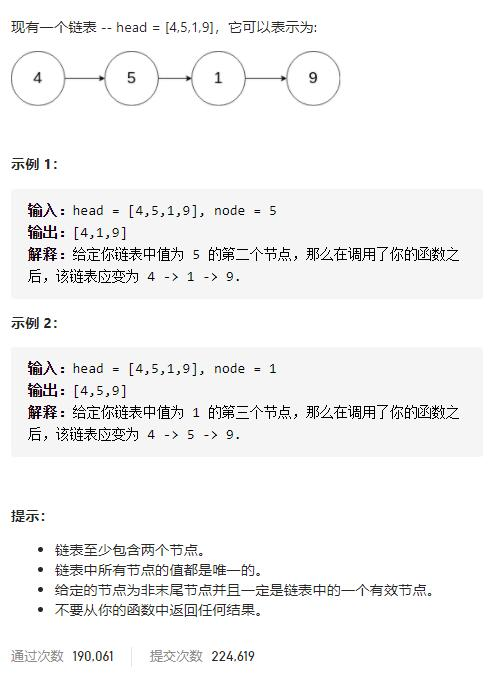

# 237-删除链表中的节点




## 方法1：把node改成其下个节点的复制，然后删掉下个节点即可

```js
/**
 * Definition for singly-linked list.
 * function ListNode(val) {
 *     this.val = val;
 *     this.next = null;
 * }
 */
/**
 * @param {ListNode} node
 * @return {void} Do not return anything, modify node in-place instead.
 */

var deleteNode = function(node) {
    node.val = node.next.val
    node.next = node.next.next
};
```

