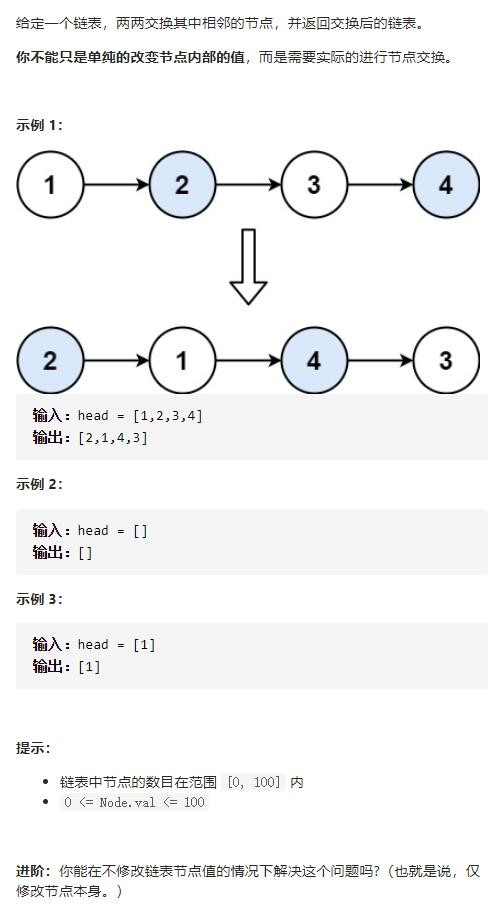
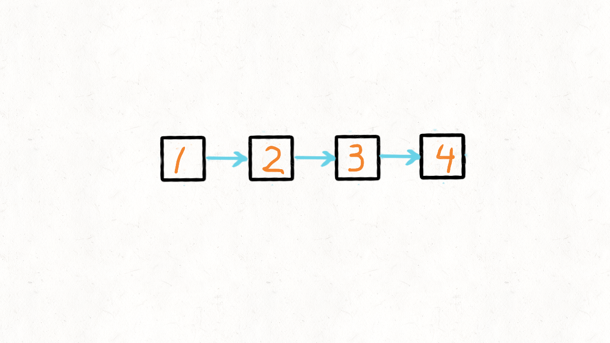

# 24-两两交换链表中的节点




## (推荐！）方法一：三指针迭代  -  需要额外添加哨兵指针

### 时间复杂度: O(n). 推进遍历整个链表故O(n).

### 空间复杂度: O(1). 使用常量级空间.




```javascript
var swapPairs = function (head) {
    let thead = new ListNode(0);
    thead.next = head;
    let pre = thead;   // 定义个循环变量
    while (pre.next != null && pre.next.next != null) {
        let first = pre.next;
        let second = pre.next.next;
        // 链表反向
        pre.next = second;  // 0指向2
        first.next = second.next;  // 1指向3
        second.next = first;  // 2指向1
        pre = first;
    }
    return thead.next;
};
```


## 方法二：递归

### 时间复杂度: O(n). 从最底层两个互换到最高层，每层时间复杂度均为O(1), 共 n/2 层故时间复杂度为 O(n/2).

### 空间复杂度: O(n). 共 n/2 层递归调用栈， 故空间复杂度为 O(n/2).


```javascript
var swapPairs = function (head) {
    // 递归的终止条件
    if (head == null || head.next == null) {
        return head;
    }
    // 假设链表是 1->2->3->4
    // 先保存节点2
    var tmp = head.next;
    // 继续递归，处理节点3->4
    // 当递归结束返回后，就变成了4->3
    // 于是head节点就指向了4，变成1->4->3
    head.next = swapPairs(tmp.next);
    // 将2节点指向1
    tmp.next = head;
    return tmp;
};
```

