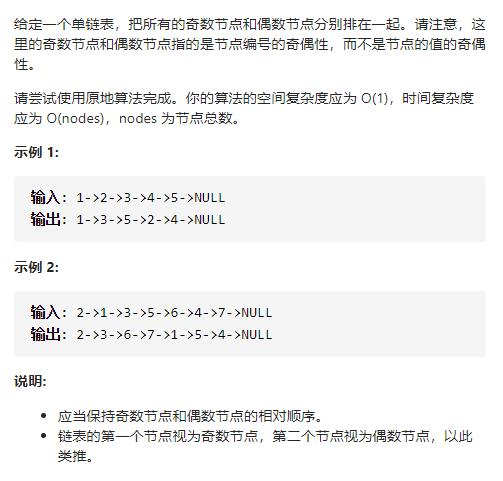
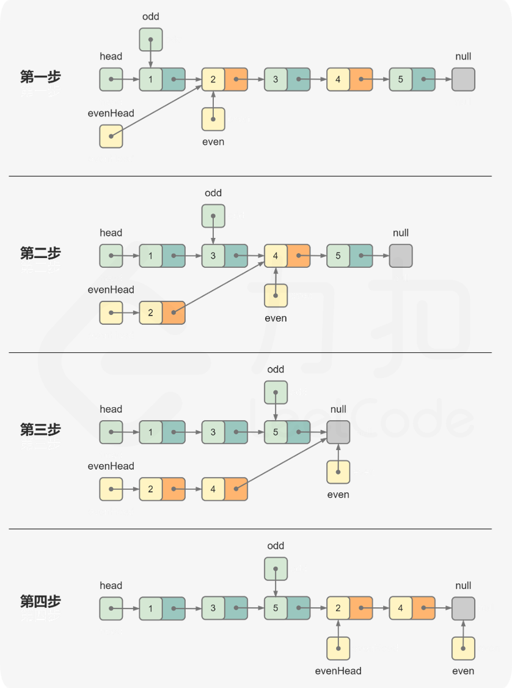

# 328-奇偶链表




## 方法1：分离节点后合并

如果链表为空，则直接返回链表。

对于原始链表，每个节点都是奇数节点或偶数节点。头节点是奇数节点，头节点的后一个节点是偶数节点，相邻节点的奇偶性不同。因此可以将奇数节点和偶数节点分离成奇数链表和偶数链表，然后将偶数链表连接在奇数链表之后，合并后的链表即为结果链表。



```js
/**
 * Definition for singly-linked list.
 * function ListNode(val, next) {
 *     this.val = (val===undefined ? 0 : val)
 *     this.next = (next===undefined ? null : next)
 * }
 */
/**
 * @param {ListNode} head
 * @return {ListNode}
 */
var oddEvenList = function (head) {
    if (!head) return head
    let evenHead = head.next,
        even = evenHead,
        odd = head
    while (even && even.next) {
        odd.next = even.next
        odd = odd.next
        even.next = odd.next
        even = even.next
    }
    odd.next = evenHead
    return head
};
```

