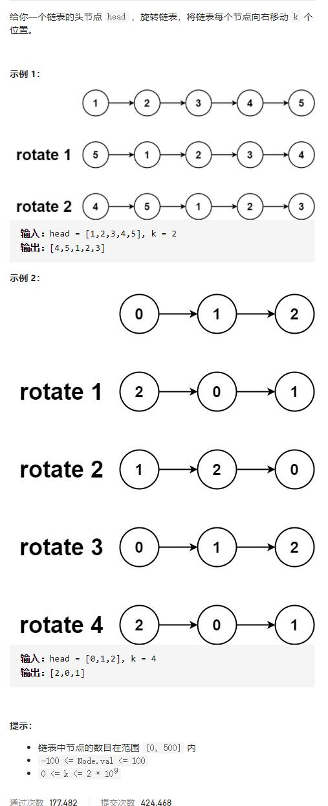

# 61-旋转链表




## 方法一：成环法

### 时间复杂度：O(n)

### 空间复杂度：O(1)

#### 先将链表闭合成环，找到相应的位置断开这个环，确定新的链表头和链表尾


```javascript
var rotateRight = function (head, k) {
    if (head == null || head.next == null || k == 0) return head;
    let n = 0;
    let p = head;
    //计算链表个数
    while (p) {
        n++;
        if (!p.next) {
            break;
        }
        p = p.next;
    }
    k %= n;
    if (k == 0) return head;
    p.next = head;
    let p1 = head;
    for (let i = 0; i < n - k - 1; i++) {
        p1 = p1.next;
    }
    head = p1.next;
    p1.next = null;
    return head;
};

// 简化版
var rotateRight = function (head, k) {
    if (head == null || head.next == null || k == 0) return head;
    let n = 0;
    let p = head;
    while (p) {
        n++;
        if (!p.next) {
            break;
        }
        p = p.next;
    }
    k %= n;
    if (k == 0) return head;
    p.next = head;
    for (let i = 0; i < n - k; i++) {
        p = p.next;
    }
    head = p.next;
    p.next = null;
    return head;
};
```

