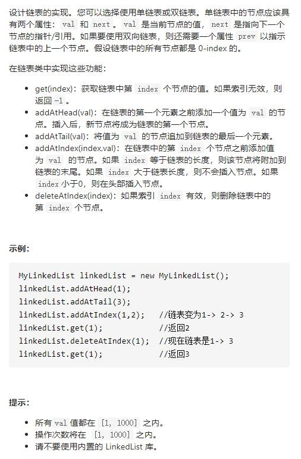

# 707-设计链表




```js
function ListNode(val, next) {
    this.val = (val === undefined ? 0 : val)
    this.next = (next === undefined ? null : next)
}

var MyLinkedList = function () {
    this.head = null
    this.tail = null
    this.length = 0
};

/**
 * @param {number} index
 * @return {number}
 */
MyLinkedList.prototype.get = function (index) {
    if (index < 0 || index >= this.length) return -1
    if (index === this.length - 1) return this.tail.val
    let cur = this.head
    while (index--) {
        cur = cur.next
    }
    return cur.val
};

/**
 * @param {number} val
 * @return {void}
 */
MyLinkedList.prototype.addAtHead = function (val) {
    let node = new ListNode(val, this.head)
    this.head = node
    if (this.length === 0) this.tail = this.head
    this.length++
};

/**
 * @param {number} val
 * @return {void}
 */
MyLinkedList.prototype.addAtTail = function (val) {
    let node = new ListNode(val)
    if (this.length === 0) {
        this.head = node
        this.tail = node
    } else {
        this.tail.next = node
        this.tail = node
    }
    this.length++
};

/**
 * @param {number} index 
 * @param {number} val
 * @return {void}
 */
MyLinkedList.prototype.addAtIndex = function (index, val) {
    if (index < 0 || index > this.length) return
    if (index === this.length) return this.addAtTail(val)
    if (index === 0) return this.addAtHead(val)
    let pre = new ListNode(0, this.head)
    while (index--) {
        pre = pre.next
    }
    pre.next = new ListNode(val, pre.next)
    this.length++
};

/**
 * @param {number} index
 * @return {void}
 */
MyLinkedList.prototype.deleteAtIndex = function (index) {
    if (index < 0 || index >= this.length) return
    if (index === 0) {
        this.head = this.head.next
        this.length--
        return
    }
    let pre = null
    let cur = this.head
    for (let i = 0; i < index; i++) {
        pre = cur
        cur = cur.next
    }
    pre.next = cur.next
    if (index === this.length - 1) {
        this.tail = pre
    }
    this.length--
};

//测试
MyLinkedList linkedList = new MyLinkedList();
linkedList.addAtHead(1);
linkedList.addAtTail(3);
linkedList.addAtIndex(1,2);   //链表变为1-> 2-> 3
linkedList.get(1);            //返回2
linkedList.deleteAtIndex(1);  //现在链表是1-> 3
linkedList.get(1);            //返回3
```

