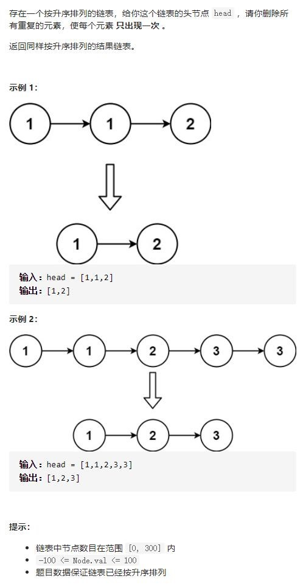

# 83-删除排序链表中的重复元素




## 方法1：迭代-不用哨兵结点

判断当前节点val与next结点的val是否相同，相同则删除next节点，只保留一个节点

思路203-移除链表元素与类似！！！

```js
/**
 * Definition for singly-linked list.
 * function ListNode(val, next) {
 *     this.val = (val===undefined ? 0 : val)
 *     this.next = (next===undefined ? null : next)
 * }
 */
/**
 * @param {ListNode} head
 * @return {ListNode}
 */
var deleteDuplicates = function (head) {
    let cur = head
    while (cur && cur.next) {
        if (cur.val === cur.next.val) {
            cur.next = cur.next.next
        } else {
            cur = cur.next
        }
    }
    return head
};
```

