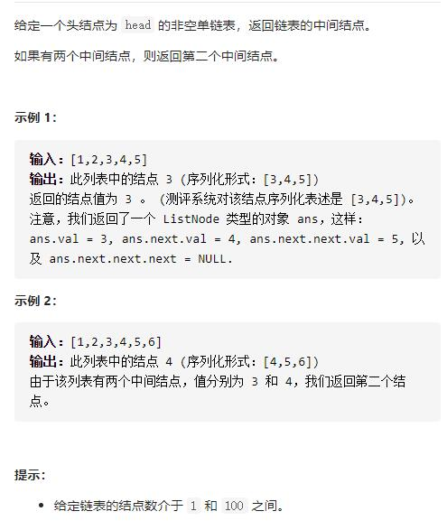
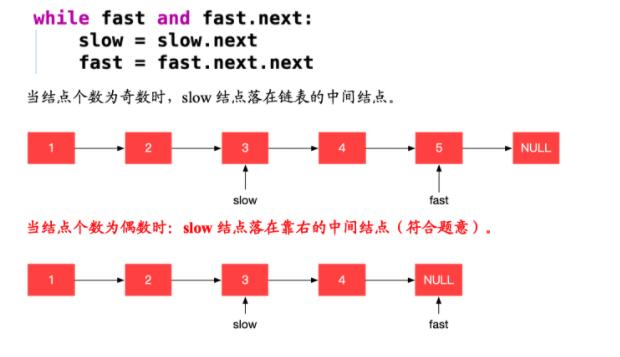
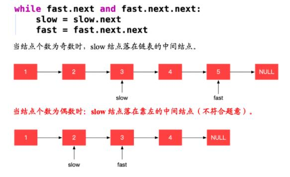

# 876-链表的中间结点




## 方法1：数组模拟

放入数组，用lengh / 2判断

```js
/**
 * Definition for singly-linked list.
 * function ListNode(val, next) {
 *     this.val = (val===undefined ? 0 : val)
 *     this.next = (next===undefined ? null : next)
 * }
 */
/**
 * @param {ListNode} head
 * @return {ListNode}
 */
//数组模拟
var middleNode = function (head) {
    let h = [],
        cur = head
    while (cur) {
        h.push(cur)
        cur = cur.next
    }
    return h[Math.floor(h.length / 2)] //注意偶数结点的中间有2个，取第2个
};
```


## 方法2：快慢(同步)指针

用两个指针 `slow` 与 `fast` 一起遍历链表。`slow` 一次走一步，`fast` 一次走两步。那么当 `fast` 到达链表的末尾时，`slow` 必然位于中间。





```js
//快慢(同步)指针
var middleNode = function (head) {
    if (!head || !head.next) return head
    let fast = head
    let slow = head
    while (fast && fast.next) { //注意偶数结点的中间有2个，取第2个时的条件判断
    // while (fast.next && fast.next.next) { //注意偶数结点的中间有2个，取第1个时的条件判断
        fast = fast.next.next
        slow = slow.next
    }
    return slow
};

//偶数结点的中间有2个，取第2个
var middleNode = function (head) {
    if (!head || !head.next) return head
    let fast = head.next.next
    let slow = head
    while (fast && fast.next) {
        fast = fast.next.next
        slow = slow.next
    }
    return slow.next
};
```

