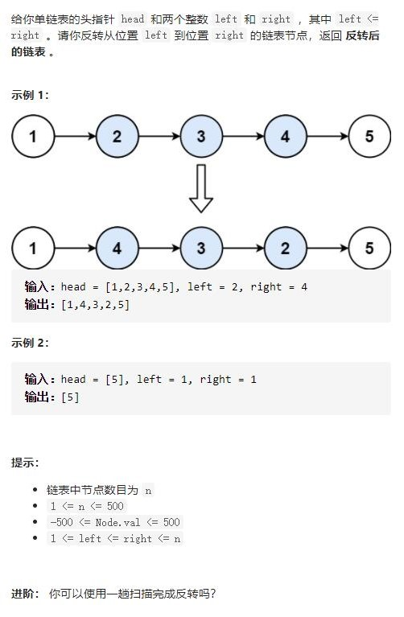
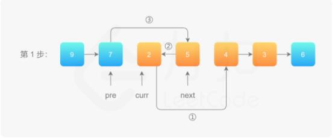

# 92-反转链表II




## 方法1：两次遍历，截取子链表 + 反转 + 拼接

```js
/**
 * Definition for singly-linked list.
 * function ListNode(val, next) {
 *     this.val = (val===undefined ? 0 : val)
 *     this.next = (next===undefined ? null : next)
 * }
 */
/**
 * @param {ListNode} head
 * @param {number} left
 * @param {number} right
 * @return {ListNode}
 */
//两次遍历，截取子链表 + 反转 + 拼接
var reverseBetween = function (head, left, right) {
    let h0 = new ListNode(0)
    h0.next = head
    let pre = h0 //定义pre指针
    //1)从虚拟头节点走 left - 1 步，来到 left 节点的前一个节点
    for (let i = 0; i < left - 1; i++) {
        pre = pre.next
    }
    //2)从 pre 再走 right - left + 1 步，来到 right 节点
    let rNode = pre
    for (let i = 0; i < right - left + 1; i++) {
        rNode = rNode.next
    }
    //3)切断出一个子链表（截取链表）
    let lNode = pre.next
    let rcur = rNode.next
    //4)切断链接
    pre.next = null
    rNode.next = null
    //5)反转链表的子区间
    reverse(lNode)
    function reverse(head) {
        let pre = null,
            cur = head
        while (cur) {
            let tmp = cur.next
            cur.next = pre
            pre = cur
            cur = tmp
        }
    }
    //拼接到原来的链表中
    pre.next = rNode
    lNode.next = rcur
    return h0.next
};
```


## 方法2：一次遍历（头插法）

先将 curr 的下一个节点记录为 next
执行操作 ①：把 curr 的下一个节点指向 next 的下一个节点
执行操作 ②：把 next 的下一个节点指向 pre 的下一个节点
执行操作 ③：把 pre 的下一个节点指向 next



```js
//一次遍历（头插法）
var reverseBetween = function (head, left, right) {
    let h0 = new ListNode(0)
    h0.next = head
    let pre = h0 //定义pre指针
    //从虚拟头节点走 left - 1 步，来到 left 节点的前一个节点
    for (let i = 0; i < left - 1; i++) {
        pre = pre.next
    }
    //定义cur指针和next指针
    let cur = pre.next
    for (let i = 0; i < right - left; i++) {
        let next = cur.next
        cur.next = cur.next.next
        next.next = pre.next
        pre.next = next
    }
    return h0.next
};
```

